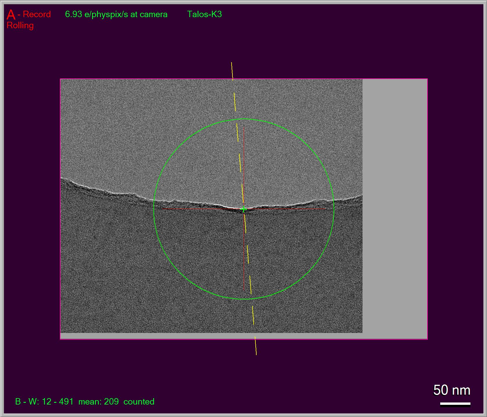

.. _SerialEM_note_define-IS-vectors:

SerialEM Note: Define Image Shift Vectors for Multiple Exposure
===============================================================

:Author: Chen Xu
:Contact: <chen.xu@umassmed.edu>
:Date Created: Sept. 27, 2023
:Last Updated: Sept. 27, 2023

.. glossary::

   Abstract
      Finding image shift vectors is among the most common tasks for
      high-throughput multiple exposure setup. 

      In this note, I try to give some "under the hood" information about the
      procedure and some new features implemented in the latest versions
      that makes this easier and more dynamic for our daily operation and
      potentially automation too. 
      
      This is for regular pattern and on a rectangular geometry grid. 

.. _manual_shift:

The Manual Way 
--------------

I suppose you probably are already familiar with the setup manual way. In
a brief summary, the steps are:

1. Define 3 x 3 (or similar) regular pattern from "Multiple Record Setup"
   dialog window. 
2. Add four corner points in an image in circular fashion. 
3. Click on button [ For Corners of Regular Pattern ], and use buttons [ IS
   to Nav Pt ] and [ Save Image Shift ] to shift to each corner point and save
   it. 

You likely will need to take a Record shot ( e.g. LD R ) to touch up the
shift positions before saving them. The figure below shows adjustment before
saving the image shift value for that corner point. 

**Fig.1 Adjusted to Center before saving**

Sometimes, you cannot see feature (such as a edge of partial hole) because
the position is too far away for the high mag. In an ideal world, the image
shift in R mag should land on the exact location of the point you picked.
But in reality, possibly due to imperfection of system calibrations, this
rarely happens. You usually have to reduce R mag temporarily or use an IS
montage at R to catch the feature, and you have to do this four times. 

Admittedly, it is a pain, at least not very fun to me.

Despite the pain, at end of the procedure in above steps, the precise image
shift vectors are determined. The image shift pattern drawn back to lower
mag image (e.g. LD View) might seem off a little. This is again due to
imperfect calibrations. No worries, in your final collected images, the
positions will be right! 

As soon as the procedure is finished, there appears a line right under
"Regular array of holes" in the dialog, something like **Spacing 2.74 and
2.75um Maximum shift: 3.9um**. If you have never done this before, this line
is not shown until you did. If you save setting file, there will be a line
starting with "MultiShotParams" containing this very information. And in
your next SerialEM session with a new grid, this information will be existed
there and likely wrong. You will have to redo this for a new grid. 

Oh, I know, you probably naturally ask: "Can we do this an easier way?" The
answer is YES. 

.. _using_hole_vectors:

Using Hole Vectors
------------------

Instead of manually adding some corner points as nav items, we can directly
use hole vectors. If we perform hole finding on an image with multiple
holes, the hole vectors become available. These are two basic vectors to
reflect hole distances in two directions and their relative orientation to
the camera system. Even there might no good hole be included, the vectors
themselves are available. They can be used to convert to Image Shift vectors
as starting point. Then we can do simply by pressing the button [ Use Last
Hole Vectors ]. 

**Fig.2 Use Last Hole Vector**
   .. image:: ../images/Capture-multi-setup-noxform.JPG
   :scale: 30 %
   :alt: Adjusted manually
   :align: center

Figure 2. shows two places get updated in the dialog after pushing "Use Last
Hole Vectors". Shown in red outline 1, the image shift vectors is updated
from the new stage hole vector conversion. And also there is an interesting
line "No adjustment transform available" in red outline 2. What is that
then? 

.. _asjutment_transform:

Adjustment Transform
--------------------

After the button pushed, we have image shift vectors. And we wanted to
refine them by stepping to and adjust so they can be accurate. This is
very much similar to previously manual shift, but we do this via a more
automatic way from "StepTo and Adjust IS" button. 

Below Figure 3. is a setup dialog from pushing "StepTo and Adjust IS"
button.

**Fig.3 Step and Adjust IS Setup**
   .. image:: ../images/Capture-StepTo-Adjust.JPG
   :scale: 30 %
   :alt: Step and Adjust
   :align: center

It can conveniently shift to a corner and take a shot for you to see, you
can adjust the position and save the image shift value, for this corner, by
pressing "Save Image Shift" like before. And you do this for all four
corner point. 

We started with a set of image shift vectors converted from stage hole
vectors initially (at LD View mag), and we ended up with final accurate set
of image shift vectors (at LD R mag)! This procedure results in an
adjustment transform matrix between the two. 

As soon as the procedure is finished, the adjustment transform is available,
and already applied for the CURRENT one, as shown in below figure 4. 

**Fig.4 Adjustment transform already applied**
   .. image:: ../images/Capture-multi-after-adjust-already-applied.JPG
   :scale: 30 %
   :alt: Step and Adjust
   :align: center

Below is the figure 5 showing 3 x 3 patterns before and after this
adjustment transform.

**Fig.5 Image Shift Patters before and after adjustment**
   .. image:: ../images/Capture-multi-after-adjust-already-applied.JPG
   :scale: 30 %
   :alt: Step and Adjust
   :align: center

The left image (A) shows image shift pattern right after converted from
stage hole vectors. The right one (Q) is the pattern after adjustment is
done. It is with more accurate vectors. Note, the beam circles in the image
(A) is in green, and they become yellow after adjustment. You may also
notice the pattern after adjustment seems slightly off from hole positions.
This is due to imperfection in calibrations (high defocus in LD View is
among the imperfection). In ideal world, the two would be lined up
perfectly. Here, the off-looking one is actually accurate set. 

.. _more_automated:

A Smarter and More Automated Way
-------------------------------

The adjustment transform matrix is preserved in setting file.

.. code-block:: ruby

   HoleAdjustXform 20 0 0 20 34 1.009630 0.005789 -0.002779 1.021203

It is a matrix between LD View (index 20) and LD R(index 34). As long as
your LD View and LD R conditions doesn't change much, this matrix works
conveniently. When you start with a new grid, your old pattern is no longer
valid, but this adjustment transform stays good. 

So for daily operation, you find hole on the new grid first and you then
"Use Last Hole Vectors". As soon as that button is pushed, the message to
tell you the transform is available shows up, as shown in red outline below. 

**Fig.6 Adjustment transform available**
   .. image:: ../images/xform-2000-79000.JPG
   :scale: 30 %
   :alt: Step and Adjust
   :align: center

You can utilize the transform by pushing the button "Apply Stored
Adjustment", your new Image Shift vectors for the pattern is updated
immediately. You might want to do "StepTo and Adjust IS" here also to refine
the IS vectors for today's condition and make sure the positions are
perfect. This time, you will find your features easily. 

It is worth mentioning that if you perform hole finding on a montage map
overview image, the map item will contain the hole vectors information. If
you save the nav file and open it in text editor, you can see the two lines:

.. code-block:: ruby

   HoleISXspacing = 2.69895 -0.758684 0
   HoleISYspacing = -0.768892 -2.71193 0 

You can then click on "Use Map Hole Vectors" on a map item and then "Apply
Stored Adjustment". As you can imagine, this can work for a grid with slight
geometry change across the grid meshes. It can also be used conveniently to
a new grid with completely different geometry. 

Once your adjustment transform is good, you can do it in script too, to have
an automated workflow. 

.. code-block:: ruby

   UseHoleVectorsForMulti 0    # 0 means LD Record mag
   AdjustMultishotPattern 0

