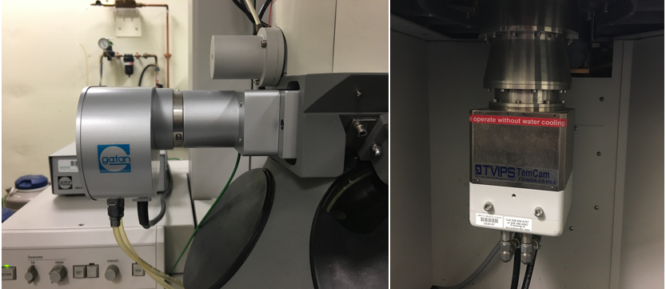
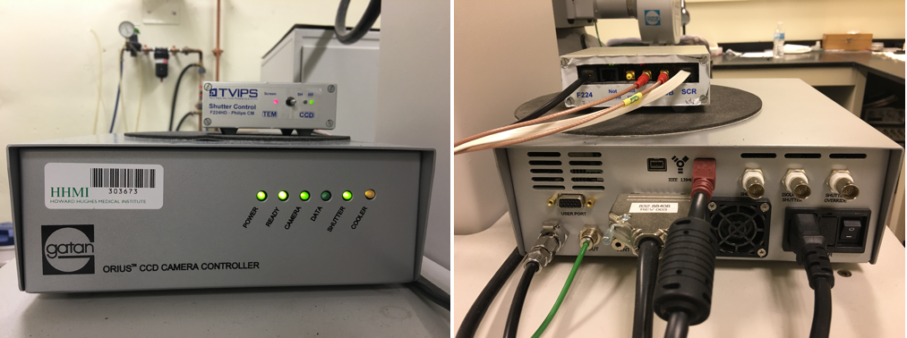
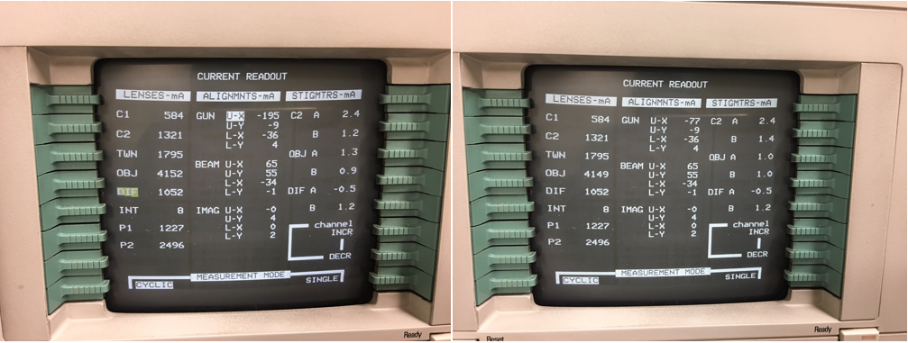
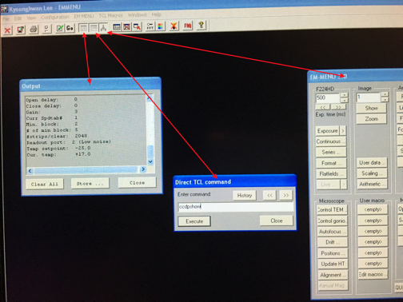
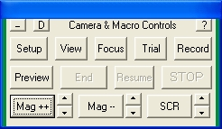

.. _ccd_cm120:

CCD Cameras on CM120
====================

:Author: Chen Xu
:Contact: <chen.xu@umassmed.edu>
:Date: 2016-7-30

.. _glossary:

  Abstract
    We no longer use film for TEM exposure anymore! Instead, we use digital camera. There are basically two types of digital 
    cameras available on the market for TEM applications - Charge-Coupled Device (CCD) and Direct Electron Detector. On CM120, 
    there are two cameras installed - Gatan Orius model 832 and Tietz TemCam 224-HD. They both are CCD type of cameras. In this 
    document, I give information about basic properties of the cameras, how to use them with CM120 and specific technical note 
    for why we need use them in such way.

    It also lists pixelsize information for both cameras so you can decide which magnification you want to use for your final image. 
    I also try to show you how to use SerialEM to control them.

.. _property:

Some Basic Properties of the Two Cameras
----------------------------------------

Here are images for the two cameras on the CM120.

**Fig.1 Camera Heads of Gatan Orius & Tietz 224HD**

..   :height: 361 px
..   :width: 833 px
   :scale: 50 %
   :alt: Gatan Orius & Tietz 224HD Cameras
   :align: left

The table below lists some basic properties of these two cameras. 

**Table.1 Some basic properties**

+--------------------------+-------------------+----------------------+
|  Property                | Gatan Orius 832   | Tietz TemCam 224-HD  |
+==========================+===================+======================+
|  Format                  |   3768 x 2672     |   2048 x 2048        |
+--------------------------+-------------------+----------------------+
| Physical PixelSize (μm)  |   9.0             |   24.0               |
+--------------------------+-------------------+----------------------+
| Digitization (bit)       |   14              |   16                 |
+--------------------------+-------------------+----------------------+
| Light Coupling Mechanism |  Fiber Optic      |   Fiber Optic        |
+--------------------------+-------------------+----------------------+
| Mounting Position        |   sided-mount     |   bottom-mount       |
+--------------------------+-------------------+----------------------+

.. _shutter-control

Shutter Control - Background Inforamtion
----------------------------------------

Shutter control usually means TEM shutter control by hardware or software of digital camera. The purpose, in most cases, is to have no beam on camera except exposure period. Not all camera requires having TEM shutter control to get an image. For cryoEM applications where accurate dose is to be concerned, it makes a lot of sense to have shutter control. Fortunately, most of high-end digital cameras for TEM have TEM shutter control support.

The shutter discussed here is not any kind of mechanical shutter. Instead, it is electronic. If an alignment coil in TEM column is put to a "bad" value, then the beam disappears due to misalignment. We call it shutter closed. And we call it open when the good alignment coil current is restored. Therefore, this kind of electronic shutter can open and close very quickly.

An exposure on film requires no beam before film is pushed in to final location and stabilized; and it opens shutter to let beam shine on film to expose and then shutter is closed again when exposure finishes. On FEI microscope with Low Dose functionality, one can even define pre-expose time. In this case, two shutters are required to work together - first shutter above specimen opens to have beam pre-expose on sample for certain period of time, then second shutter below specimen opens to start exposure on film. Usually, the two alignment coils to be controlled as upper and lower shutters are Gun Upper coil and a Film Shutter Coil next to projector lens. All this is done within FEI software control for when and which shutter is open or close. We usually call this internal shutter control.

To image with a digital camera, especially for a beam sensitive specimen, shutter control is therefore also needed. If configured correctly, when camera is inserted and large screen of TEM is lifted, the beam should be blanked. This shutter control is achieved by changing the same alignment coils using shutter cable(s) from camera controller. The shutter cable directly connects to TEM hardware so that when large screen is lifted, an extra voltage is sent to TEM coil to "screw up" a good alignment. Thus, beam is blanked. If we need to pre-expose our sample for whatever reason, then two cables will be needed - one for pre-specimen and one for post-specimen. This control is done by using external hardware. We normally call this "external" shutter control as it is not via TEM software.

For convenience, we usually call the shutter of Gun Upper Coil "the beam blanker"; and Film Shutter Coil "the film shutter".

.. _shutter-control-setup

Shutter Control Setup for Orius 831 and TemCam 224HD
----------------------------------------------------

The Orius controller for 35mm port sided-mount camera has no shutter cable from the controller. Therefore, it doesn't control the beam at all. It is possible to add the shutter control cable to the system, but for acquisition of an image, the TEM shutter control is optional for this camera. Of course, as you might imagine, this is not ideal for cryoEM application.

The picture below is the front and back to Orius camera controller, and Tietz camera shutterbox as well(small one on the top). You can see there is no cable hooked on Orius controller for shutter control.

**Figure 2. Front and Back of controller of Orius and shutterbox of TemCam 224-HD**

For TemCam 224HD camera, there are shutter control cables from the controller box, shown in the image above. This is little box on the top of Orius controller. As explained in previous section, the two shutter control cables (in red)are directly connected to TEM hardware. And there is a flat ribbon-like cable, is also connected to TEM hardware. That is to control signal with large screen of TEM being Up or Down. To be more specific, when large screen is lifted Up, the signal from this "Screen" cable to controller box triggers a 5V signal being sent to scope via the two shutter control cables, so beam is blanked with large screen position as a switch.

The two cables with red connectors are labeled "BB" and "SH", for Beam Blanker and Shutter respectively. BB cable is connected to Gun Upper Coil as explained in previous section. It can be confirmed from scope "CURRENT READOUT " page. Below is two screen snapshots for large screen being at Down and Up. You can see the Gun Upper Coil current values in these two situations. One can easily see the Gun U-X is changed from -77 to -195 when screen is lifted.

**Figure 3. Gun Coil Current Changes When Large Screen Up (left) and Down (right)**

When you lift the screen, you should also see beam disappearing suddenly.
  
.. Note::

   SH shutter is hooked to the film shutter coil, which is not among the coil currents displayed here. It is indeed working. One can confirm this by disconnecting BB cable - the beam still disappears when large screen is UP. According to the vendor, this shutterbox can not provide pre-expsure function. One will have to upggrade to shutterbox II for that.

.. Note::

   The dip switch on Tietz camera control box has to flip to right "CCD". If it is on "TEM", the shutter control by Tietz CCD is completely off.

.. _temperature:

A Note about the Temperature
----------------------------

These both CCD cameras are water cooled. More strictly speaking, the dissipated heat from electronic cooling has to be taken away by water. Therefore, we must to have cooling water running normally to run the CCD cameras. The set working temperature for Orius is 10°C, and it is -25°C for Tietz TemCam 224HD. The advantage to have lower temperature for CCD imaging is low thermal noise. In general, it is advisable to let CCD be cooled long enough before using the camera. In most labs, the CCD camera is simply left ON all the time until camera chamber is vented.

The temperature can be checked for each camera using their softwares. For Orius, from DigitalMicorgraph, one can check menu Camera - Temperature. On Tietz camera, one has to start up TCL interface and also EMMENU from TCL. After that, one has to open result log window and command window. From command window, type "ccdpshow" and then hit [ Execute ]. The temperature will show in result window.

**Figure 4. command "ccdpshow" to get temperature for 224HD**

.. _serialem:

Control both cameras using SerialEM
-----------------------------------

Each camera has its own controlling software. It is DigitaMicrograph (DM) for Orius and EM-MENU for Tietz. In order to have pixel size information, both software tries to communicate with CM120 via a single COM port. If you run start both softwares, one of them will complain for not being able to connect to COM port. You can still take images using either one, just you might not get scale bar for one camera.

For image data that will be processed later, the scale bar is not that important, but the pixelsize is. And we don't have to always use its own native software to control CCD camera to get an image. One of the good alternative is SerialEM.

SerialEM is a program for TEM data collection for both single particle and tomography applications. It communicates to TEM and digital camera. Currently, it doesn't support CM120 without any hacking due to TEM software, but it controls both cameras we have just fine. One of the advantages with SerialEM is to be able to directly save data as stack file and MRC as image format.

SerialEM controls Gatan camera by a plugin dll file put in Gatan's plugin folder. In this case, DM has to started. When controlling Tietz camera, it directly talks to the Tietz's registered dll modules. In this case, no Tietz software needs to be started. Therefore, one starts DM first and then start SerialEM and you are ready to go!

Since SerialEM doesn't talk to CM120 computer, we have to use fake mag and screen position to match the real situation on scope. This way, the image file saved on SerialEM will have valid and correctly pixelsize information in MRC header.

**Figure 5. Camera Setup Window where one can change mag and screen position to match scope**

To use it, you click on the three macro buttons ``Mag++``, ``Mag--`` and ``SCR`` to match current microscope state. That's it.

.. _electron-dose

Electron Dose
-------------

A proper dose on sample for an exposure is important. If the total dose is too low, the signal to noise ratio is low. If the total dose is too high, the sample gets radiation damage during exposure. With the latest CMOS direct electron detector, we might be able to record a single exposure into many separable frames, but the idea for dose and radiation damage still holds.

On a real system, if we know the value how many counts generated from one primary electron under a specif accelerating voltage, and we can calculate the total dose (e/A^2) from the mean value of the counts in an image.

SerialEM is setup so that it reports the dose on specimen on the top of the image display, for every and each image.

.. _pixelsize

Pixlesize Calibration for Both Cameras
--------------------------------------

The table below list pixelsize at specimen level for different scope magnifications. Please note that with large screen position as Up and Down, the CM120 TEM interface displays different mag values. There is no difference in term of lens current in this case - this is due to the recording media being at different "collecting" level along the projection. ScreenDown mag means at screen level and ScreenUp means at film level. We run Orius with screen Down and Tietz with Screen Up.

The magnifications display in TEM interface are nominal. For actual magnification or pixelsize at specimen for a CCD camera, careful calibration is needed. Below is the calibration table for both cameras.

+-----------------------+---------------------------+---------------------------+
|Mag_Screen UP/DOWN (X) | Pixelsize_Orius(nm) bin=1 | Pixelsize_Tietz(nm) bin=1 |
+=======================+===========================+===========================+
|35 / 31                | 1134                      | 464                       |
+-----------------------+---------------------------+---------------------------+
|45 / 40                | 882                       | 361                       |
+-----------------------+---------------------------+---------------------------+
|60 / 54                | 661                       | 270                       |
+-----------------------+---------------------------+---------------------------+
|80 / 71                | 496                       | 203                       |
+-----------------------+---------------------------+---------------------------+
|110 / 97               | 361                       | 148                       |
+-----------------------+---------------------------+---------------------------+
|150 / 135              | 265                       | 108                       |
+-----------------------+---------------------------+---------------------------+
|190 / 170              | 209                       | 85.4                      |
+-----------------------+---------------------------+---------------------------+
|260 / 230              | 153                       | 62.4                      |
+-----------------------+---------------------------+---------------------------+
|340 / 300              | 117                       | 47.7                      |
+-----------------------+---------------------------+---------------------------+
|450 / 400              | 87.3                      | 36.1                      |
+-----------------------+---------------------------+---------------------------+
|600 / 530              | 66.1                      | 27.0                      |
+-----------------------+---------------------------+---------------------------+
|800 / 710              | 49.6                      | 20.3                      |
+-----------------------+---------------------------+---------------------------+
|1000 / 880             | 39.7                      | 16.2                      |
+-----------------------+---------------------------+---------------------------+
|1400 / 1259            | 28.4                      | 11.6                      |
+-----------------------+---------------------------+---------------------------+
|1800 / 1040            | 22.3                      | 9.11                      |
+-----------------------+---------------------------+---------------------------+
|2300 / 2050            | 17.7                      | 7.22                      |
+-----------------------+---------------------------+---------------------------+
|3000 / 2650            | 13.1                      | 5.22                      |
+-----------------------+---------------------------+---------------------------+
|3800 / 3400            | 10.3                      | 4.18                      |
+-----------------------+---------------------------+---------------------------+
|5000 / 4400            | 8.03                      | 3.27                      |
+-----------------------+---------------------------+---------------------------+
|6300 / 5600            | 6.09                      | 2.47                      |
+-----------------------+---------------------------+---------------------------+
|8000 / 7100            | 4.84                      | 1.96                      |
+-----------------------+---------------------------+---------------------------+
|10000 / 8800           | 3.94                      | 1.59                      |
+-----------------------+---------------------------+---------------------------+
|13000 / 11500          | 3.01                      | 1.23                      |
+-----------------------+---------------------------+---------------------------+
|17000 / 15000          | 2.34                      | 0.948                     |
+-----------------------+---------------------------+---------------------------+
|22000 / 19500          | 1.94                      | 0.836                     |
+-----------------------+---------------------------+---------------------------+
|28000 / 25000          | 1.50                      | 0.648                     |
+-----------------------+---------------------------+---------------------------+
|35000 / 31000          | 1.18                      | 0.508                     |
+-----------------------+---------------------------+---------------------------+
|45000 / 40000          | 0.909                     | 0.392                     |
+-----------------------+---------------------------+---------------------------+
|60000 / 53000          | 0.647                     | 0.279                     |
+-----------------------+---------------------------+---------------------------+
|75000 / 66000          | 0.523                     | 0.225                     |
+-----------------------+---------------------------+---------------------------+
|100000 / 88000         | 0.404                     | 0.164                     |
+-----------------------+---------------------------+---------------------------+
|125000 / 110000        | 0.323                     | 0.131                     |
+-----------------------+---------------------------+---------------------------+
|160000 / 140000        | 0.253                     | 0.102                     |
+-----------------------+---------------------------+---------------------------+
|200000 / 175000        | 0.202                     | 0.082                     |
+-----------------------+---------------------------+---------------------------+
|260000 / 230000        | 0.155                     | 0.063                     |
+-----------------------+---------------------------+---------------------------+
|340000 / 300000        | 0.119                     | 0.048                     |
+-----------------------+---------------------------+---------------------------+
|430000 / 380000        | 0.094                     | 0.038                     |
+-----------------------+---------------------------+---------------------------+
|580000 / 510000        | 0.070                     | 0.028                     |
+-----------------------+---------------------------+---------------------------+
|750000 / 660000        | 0.054                     | 0.022                     |
+-----------------------+---------------------------+---------------------------+

