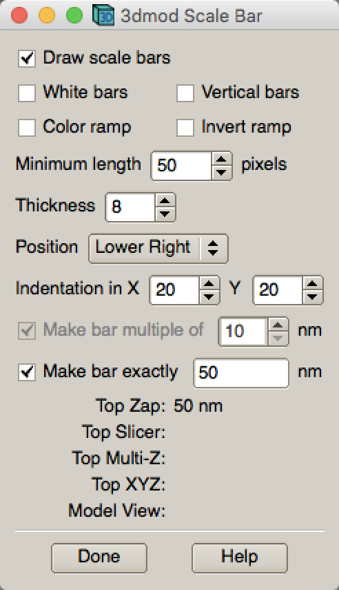

.. cryo-em_faq:

FAQ
===

:Author: UMass CryoEM Core
:Contact: <cryoem.umms@gmail.com>
:Date-created: 2017-2-13
:Last-updated: 2019-8-21

This is list of Frequently Asked Questions about Umass Cryo-EM. Some questions are technical, while others are more general. 

How do I ...
------------

.. _application:

... get access to your facility?
~~~~~~~~~~~~~~~~~~~~~~~~~~~~~~~~

We are core facilty and open to everyone who wants to access including industry customers. 

What is the logistics? Normally, you can start inqury via email or phone call. If our facility is suitable for your projects, we will ask you to submit electronic forms for sample submission and request of instruments. The sample submission form is required by bio-safety office, for any sample coming to Umass Med Sch campus. After we receive your submitted forms and things seem to be in order, our administration will send you a quote for you to obtain a PO for the work or/and instrument time. And we usually can schedule time for you shortly. Our waiting time is usually long, so it is good to plan early. 

We have price rate policy for each year. It is not published on the web page, but is available upon request. 

.. _direction:

... get to your facility location?
~~~~~~~~~~~~~~~~~~~~~~~~~~~~~~~~~~

Please follow this site for main direction and the campus map - https://www.umassmed.edu/bmp/about/directions/

We are located at Medical School Building - A floor SA-106. You enter the "SCHOOLS" building from "medical school lobby" indicated on the campus map. After exiting elevator at A floor, turn left. Half way down the hallway, you will see a sign for "CryoEM Core Facility". Call facility office # 774 455 4049 if you are lost. 

For parking, you should use "South Road Parking Garage" on South Road, the opposite side of two flags. 

For for nearby hotel to stay, there are a couple of possibilities within walking distance.

1) https://www.beechwoodhotel.com/

2) https://www.marriott.com/hotels/travel/bosri-residence-inn-worcester/?scid=bb1a189a-fec3-4d19-a255-54ba596febe2

.. _display:

... display the screened data on my own computer locally?
~~~~~~~~~~~~~~~~~~~~~~~~~~~~~~~~~~~~~~~~~~~~~~~~~~~~~~~~~

The data for screening is usually at three kinds. 

1. Low Mag Montage (LMM) map (grid atlas), usually taken at mag from ~50X to ~150X. The data itself is in MRC 16-bit sign integer format. 
   It is a MRC stack file containing about ~62 pieces if at 46X. 
   
2. Medium Mag Montage (LMM) maps (square atlas) or some single shots.  This is usually taken at lower range of M on Talos, such as 1750X. It is also MRC stack file. 

3. High mag shots, usually taken at 22,000X or 28,000X. It is MRC stack file, each section is from an exposure. If K2 camera frame mode is used, the secion is usually a single image from aligned movie stacks in-fly. 

.. Note::

   The MRC files we saved here usually have filename extension as **mrc**, **st** (for stack file) and **map**. Regardless the extensions, they are all simply MRC files. 

All the three kinds of data can be easily viewed using IMOD. For Windows, if you don't want to install full IMOD package, a stripped version of display portion called "Windows3dmod" can be insatalled - from http://bio3d.colorado.edu/ftp/Windows3dmod/. For all the other platforms including Windows, a complete IMOD software package is available. IMOD User Guide can be found in http://bio3d.colorado.edu/imod/doc/guide.html. 

.. Note::
   
   - Since September 2017, most of screening images are also saved into JPG format at the same time when MRC files are saved. This gives you a quick feedback for your sample conditions. The small file size makes it easy for us to upload to DropBox to share with users.
   
   - After March 2018, all JPG files saved are true JPG instead of JPG compressed TIFF as before. They can be opened by almost any standard image software including ImageJ and Photoshop.
   
.. _scale_bar:

... insert a scale bar into the screened image? 
~~~~~~~~~~~~~~~~~~~~~~~~~~~~~~~~~~~~~~~~~~~~~~~

1. Open a MRC image with IMOD.

2. IMOD - Edit - Scale Bar ... 

   
3. With proper scale bar displayed, press SHIFT+S. It will save a jpeg file with scale bar inserted. 

4. Click "Done" to dismiss the setup window. 

.. _mount_ntfs:

... mount the data hard drive I received from you?
~~~~~~~~~~~~~~~~~~~~~~~~~~~~~~~~~~~~~~~~~~~~~~~~~~

The hard drive for data should be in its original filesystem which is normally Windows NTFS. The interface on the hard drive should be USB3. It is in my mind that the drive should be most compatable possible. 

If you plug the hard drive onto a Windows or Mac computer, the volume should automatially show up. And you can copy data out from the volume directly. 

If you want to mount the hard drive directly onto a Linux computer, you have to connect and mount it manually. 

After plugging the hard drive to USB port (USB3 preferred) on Linux computer, you should be able to see lines similar to these from `dmesg` command output on linux computer. 

.. code-block:: none

   [334449.716558] usb 4-1: new SuperSpeed USB device number 2 using xhci_hcd
   [334449.728460] usb 4-1: New USB device found, idVendor=0bc2, idProduct=ab34
   [334449.728482] usb 4-1: New USB device strings: Mfr=2, Product=3, SerialNumber=1
   [334449.728485] usb 4-1: Product: Backup+  Desk
   [334449.728487] usb 4-1: Manufacturer: Seagate
   [334449.728489] usb 4-1: SerialNumber: NA7H29DX
   [334449.749996] usbcore: registered new interface driver usb-storage
   [334449.752139] scsi host6: uas
   [334449.752539] scsi 6:0:0:0: Direct-Access     Seagate  Backup+  Desk    040B PQ: 0 ANSI: 6
   [334449.752586] usbcore: registered new interface driver uas
   [334449.768013] sd 6:0:0:0: [sdc] Spinning up disk...
   [334449.768023] sd 6:0:0:0: Attached scsi generic sg3 type 0

From this, you can see the logic volume is assigned to *sdc*. 

On RedHat/RHEL7, CentOS 7 and Scientific Linux 7 and possibly later versions of Linux flavors, the NTFS filesystem is directly supported. For older version of Linux, you might have to install *ntfs-3g* package first. Therefore, you can mount the volume easily with a mounting command as below.

.. code-block:: none

   $ sudo mount -t ntfs /dev/sdc2 /mnt

This command should not give you errors. After the command, you should be able to see the volume is mounted using `df` output

.. code-block:: none

   /dev/sdc2                   4883638268  1418392 4882219876   1% /mnt

and you should see a few more lines in `dmesg` output like this:

.. code-block:: none

   [334450.768547] ................ready
   [334465.784580] sd 6:0:0:0: [sdc] 9767541167 512-byte logical blocks: (5.00 TB/4.54 TiB)
   [334465.784585] sd 6:0:0:0: [sdc] 2048-byte physical blocks
   [334465.817288] sd 6:0:0:0: [sdc] Write Protect is off
   [334465.817294] sd 6:0:0:0: [sdc] Mode Sense: 4f 00 00 00
   [334465.817451] sd 6:0:0:0: [sdc] Write cache: enabled, read cache: enabled, doesn't support DPO or FUA
   [334466.214227]  sdc: sdc1 sdc2
   [334466.215286] sd 6:0:0:0: [sdc] Attached SCSI disk
   [334626.393838]  sdc: sdc1 sdc2

.. _image_condition:

... know the image conditions of the data collected on your system?
~~~~~~~~~~~~~~~~~~~~~~~~~~~~~~~~~~~~~~~~~~~~~~~~~~~~~~~~~~~~~~~~~~~

1. From *Frames.mdoc* file. This is a metadata file to record all the conditions for each frame stack file collected. It contains 
   the most complete information inclduing total dose, stage positions, frame dose, frame numbers and navigator label for this exposure. 

A typical section of *Frames.mdoc* file is as following:

.. code-block:: ruby

   [FrameSet = 0]
   TiltAngle = 0.00249969
   StagePosition = 24.2868 -41.113
   StageZ = -29.8365
   Magnification = 105000
   Intensity = 0.114429
   ExposureDose = 34.9645
   PixelSpacing = 0.694291
   SpotSize = 8
   Defocus = -3.33245
   ImageShift = -2.22045e-016 -7.77156e-016
   RotationAngle = -94.0936
   ExposureTime = 7
   Binning = 0.5
   CameraIndex = 1
   DividedBy2 = 0
   MagIndex = 31
   CountsPerElectron = 35.3
   TargetDefocus = -2.2
   SubFramePath = X:\Anna_20171223\1015B_g1_0000_Dec23_13.20.21.tif
   NumSubFrames = 35
   FrameDosesAndNumber = 0.99898 35
   DateTime = 23-Dec-17  13:20:32
   NavigatorLabel = 84-1
   
You might be interested only in total dose, pixelsize, frame dose and frame numbers etc., but it contrains fairly complete information. 
   
2. From *Setup.png* - an image file. This is snapshot for Camera Setup Dialog window and with frame data setup window. This image shows 
   total dose, dose rate on camera, frame numbers, frame time etc.. 
   
3. From image header. You can get header information for MRC and TIFF image stack by an IMOD program *header*:

.. code-block:: none

   $ header image-stack.mrc 

.. _use_defect_motioncor2:

... use the defect file for MotionCor2?
~~~~~~~~~~~~~~~~~~~~~~~~~~~~~~~~~~~~~~~

According to SerialEM helpfile - http://bio3d.colorado.edu/SerialEM/hlp/html/about_camera.htm, here are the step to 
convert defect map that MotionCor2 needs:

Finally, if you want to run MotionCor2 directly on the unnormalized data, you should give it a defect map file as well as the gain reference file.  You can make a defect map from the text file with 'clip defect' in IMOD 4.10.7 or higher:

.. code-block:: none

   clip defect -D defects...txt  fileWithFrames  defects...mrc

where the fileWithFrames is used only to set the size of the output and can be any file of the right X and Y size.  To make a compressed TIFF file, which will be much smaller, use:

.. code-block:: none

   clip defect -D defects...txt  -f tif  fileWithFrames  defects...tif

What is ...
------------

.. _screen:

... service and charging details about your screening service?
~~~~~~~~~~~~~~~~~~~~~~~~~~~~~~~~~~~~~~~~~~~~~~~~~~~~~~~~~~~~~~

Screening result usually includes 1) Low Mag Montage (LMM) maps at about 34X mag for entire grid atlas, 2) Medium Mag Montage (MMM) maps at about 2000X for a few promising meshes, 3) final mag shots for 10-20 holes. We also provide JPEG format too for convenient cloud reviewing. 

For academic, the screening mostly happens on Talos. We split Talos 24 hours into two session - daytime and evening. If you have more than 8 grids, we will simply regard as daytime session. Less than 6, will be charged by per grid, which is less expensive than being regarded as a daytime session. So you may only screen 2-3 grids, for example, and we won't charge by session in that case. We are very flexible at this and take the cost of customer into consideration. 

The most common style to screen is to load 8-9 grids and start to screen, by 5 or 6PM of that day, one of the good conditions is located and we extend into full day (24 hours) session by collecting on the good grid into next morning 9 AM. We could get as many as 1000+ movie stacks. These are high quality shots on Gatan K2/K3 camera. People get about 3A resolution structures on our Talos with similiar setup. 

Please ask us if you have further questions. 

.. _data:

... the data I will receive from your facility after imaging?
~~~~~~~~~~~~~~~~~~~~~~~~~~~~~~~~~~~~~~~~~~~~~~~~~~~~~~~~~~~~~~

You received mainly three or four folders as below:

**rawTIFF folder**:
TIFF - compressed image stack containing multiple image frames, not gain normalized
pcm - IMID python command file for frame alignment using IMOD program
mdoc - adoc file that contains all the imaging condition information
log - it is log file of aligning result (after run pcm file to align frames)

**alignedMRC foler**:
*_ali.mrc files - those are aligned of multiple movie frames, they are single images not movie frames

**alignedJPG folder**:
JPG snapshot of the aligned MRCs together with power spectrum. These are for visually check image quality and sample condition.

**SerialEM-Maps folder**:
all the control files for SerialEM software running for the session, it contains useful information each shot is from which grid, which region etc.. It is part of the session data, but less useful for end user to process the data.

.. _Cs:

... the Cs value I should use for CTF calculation for Talos and Krios?
~~~~~~~~~~~~~~~~~~~~~~~~~~~~~~~~~~~~~~~~~~~~~~~~~~~~~~~~~~~~~~~~~~~~~~

2.7mm for both Talos Arctica and Titan Krios. 

.. _obtain_data:

... the method I can get my data after collected at your facility?
~~~~~~~~~~~~~~~~~~~~~~~~~~~~~~~~~~~~~~~~~~~~~~~~~~~~~~~~~~~~~~~~~~

UMass Med School has firewall and VPN in place. There is no way to "pull" data from our storage without establishing VPN first. However, outbound traffic - "push" is possible. There are three ways we can send data to you. 

- At Harvard Medical School, some labs ask SBGrids folks to setup a DropBox like account for their lab. With specific command, we can push data directly from our storage to HMS special DropBox location. It is then easy to transfer internally then. 

- If you setup an user account on a Linux box for us, we can transfer data via sftp or via rsync over sftp protocol. We can also use your personal account without knowing your password but using SSH keys. We provide our public key to you and you put it in ./ssh/known_hosts, and we can establich connection using our private key at our end. You can remove that line to disable the possibility of connection. 

- The data can be also send to you after copying onto a portable HDD drive with USB3 interface. Default NTFS filesystem coming with most of the HDD is usually working fine. 

- AWS. Cloud is becoming reasonable and attractive way to store and compute data. If you setup AWS S3 bucket, and you link that with our ID and secret key, we can upload onto AWS S3 bucket easily. The overall speed is not very fast, but it seems to be not bad either. For institutions who already have this, we recommend to use this way. 

.. _dose_and_dose_rate:

... What is difference between dose and dose rate? What condition should I use? 
~~~~~~~~~~~~~~~~~~~~~~~~~~~~~~~~~~~~~~~~~~~~~~~~~~~~~~~~~~~~~~~~~~~~~~~~~~~~~~~

They are two different things, but related by the magnification of microscope. 

Normally, dose means the total electrons hitting the specimen in a unit area. It usually has unit like e\ :sup:`-`/Å\ :sup:`2`. 

Dose rate means how strong the beam is, it is how many electrons hitting in one physical pixel area on the detector sensor for a unit time period. It usually has a unit like **primary electrons/unbinned pixel/second**. A proper dose rate is required for optimal performance of a camera. 

Under a giving beam condition, your dose rate is fixed, you can change exposure time to obtain target total dose on specimen. Therefore, we should always determine the proper dose rate first. 

