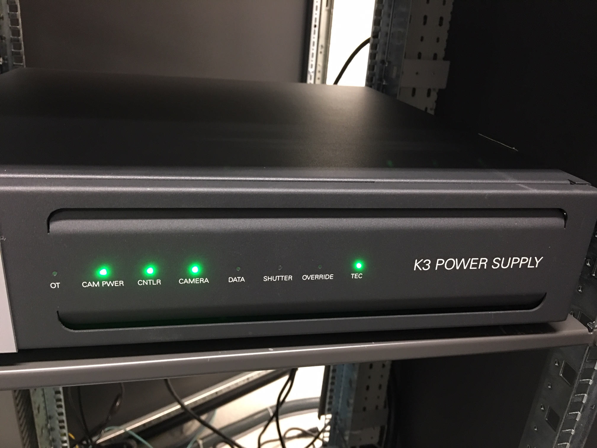
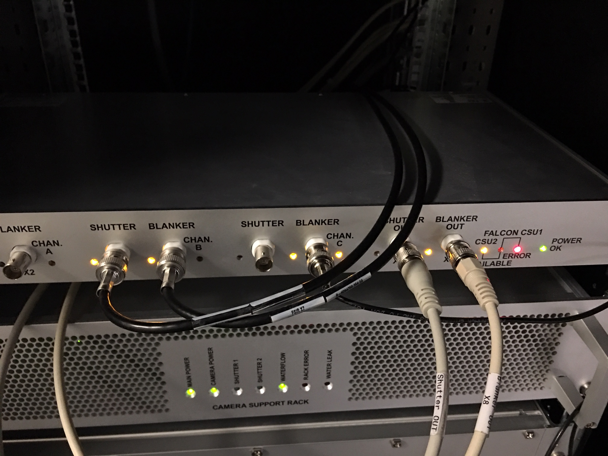

.. _SerialEM_K3_installed_on_Talos:

SerialEM Note: K3 is installed on Talos
=======================================

:Author: Chen Xu
:Contact: <chen.xu@umassmed.edu>
:Date_Created: 2018-10-25
:Last_Updated: 2018-10-28 

.. glossary::

   Abstract
      We have upgraded from K2 to K3 on Talos Arctica. Overall, we have had more positive experience than negative one. 
      We are now collecting the first benchmark data, just one week after K3 installation was completed. Of course, we are using 
      SerialEM on it. 
      
      I wanted to share our experience here. Hope it helps people to prepare for their own installation.    
      
.. _installation:

Installation Went Smooth 
------------------------

The installation was fairly smooth. The engineers had installed K3 at other sites before so they have quite some experience 
already. Total installation only took three full days. We had two K3 systems in crates - one for Talos and one for Krios. 
Therefore, one unique advantage we had was an extra set of identical hardware components to swap test when needed. 

There were two failed hardware in the original package for Talos, one was processing board and the other was MIB box and 
cable. Once these two faulty hardware components were replaced with ones in Krios K3 crates, the system came up nicely. 

One can imagine, without spare hardware parts to trial and test, the installation could have taken a lot longer. We were lucky.

.. _serialem:

SerialEM Control 
----------------

It was pretty easy to get good control of K3 camera based on previous K2 camera setup. There are only a few things we needed to redo for 
SerialEM calibration. 

1. Camera Timing and Shutter Dead Time.

#. Image Shift calibration for all the mags to be used.

#. Pixelsizes at mag index 4, 16 and 17. They are 46X(LM), 2300X(LM) and 1250X (M). *Note: This is only to get SerialEM going, 
   more precise measurement of pixelsize at final image mags will need to be done carefully using different methods, for high 
   resolution image processing.* 
   
#. Stage Shift calibration for mag index 4, 16 and 17. They are 46X(LM), 2300X(LM) and 1250X (M). Double check tilting axis 
   angles from this step too. 

The K3 camera section of properties is below:

.. code-block:: ruby

    CameraProperties	         1
    Name                      K3
    K2Type	                  3
    DMGainReferenceName	     K3-18140113 Gain Ref. x1.m0.dm4
    # THESE 5 WILL NEED CHANGING IF CAMERA ORIENTATION CHANGES
    CameraSizeX	             5760
    CameraSizeY	             4092
    SizeCheckSwapped             1
    RotationAndFlip              0		# accedently 1 before
    DMRotationAndFlip            0
    #UsableArea                  0 0 3712 3840 	# top left bottom right!
    UseSocket	              0
    MakesUnsignedImages	     1
    XMustBeMultipleOf	     4
    YMustBeMultipleOf	     2
    FourPortReadout	        0
    Binnings	             1 2 3 4 5 6 8
    BasicCorrections	            49
    HotPixelsAreImodCoords	      1
    #DarkXRayAbsoluteCriterion   20
    #DarkXRaySDCriterion	      15
    #DarkXRayRequireBothCriteria 1
    MaximumXRayDiameter	         6
    BeamBlankShutter	            0
    OnlyOneShutter	            1
    StartupDelay                 1.195
    ExtraBeamTime                0.10
    BuiltInSettling              0.0 
    ShutterDeadTime	            0.00		
    MinimumDriftSettling	      0.05
    MinimumBlankedExposure       0.35
    ExtraUnblankTime	            0.012
    ExtraOpenShutterTime	      0.12
    Retractable	               1
    InsertionDelay	            5.0
    RetractionDelay	            3.0
    GIF	                        0
    Order                        2
    FilmToCameraMagnification    1.31	# orig=1.342
    PixelSizeInMicrons	         5.0  
    #CountsPerElectron	         #37.55	not needed for K3 # measured at 3.15 e/p/s
    ExtraRotation	               0.
    # MagIndex  DeltaRotation (999 not measured)  SolvedRotation (999 not measured)   
    # Pixel size (nm, 0 not measured)
    ##RotationAndPixel 33 0.04 999 0.0749
    #RotationAndPixel 1 999 -3.9 0
    #RotationAndPixel 4 999 -102.4 0
    RotationAndPixel 3 999 -94.4 0
    #RotationAndPixel 16 999 -4.9 1.797
    RotationAndPixel 16 999 -94.4 1.74	#k2=1.797
    RotationAndPixel 17 999 90.9 3.291	#k2=3.396

    EndCameraProperties

.. _shutter:

Shutter Control 
---------------

There are a number of things one should pay attention to, in my opinion. The shutter control is the top 1 on the list. 

**Shutter control**. This is perhaps the most important thing you do not want to miss. If shutter control is not working properly, 
you might have sample burned without notice. Normally, if shutter control is not working, you will have hard time preparing gain 
reference. So you might notice it. However, since we are not required to prepare gain reference often in daily bases, if it stops working, you might or might not notice it promptly. You might still get image, but your sample might not be protected as it should be. 

With properly working shutter, the beam will get blanked if following conditions are all met:

1. Hardware components are communicating with each other normally. 

#. DM is running and K3 camera is in inserted position.

#. Software configuration in DM interface - Camera Configuration has set properly as idle state for shutter one "Pre-specimen" 
   to be closed. There is normally only single shutter cable from Gatan MIB box - shutter 1 connecting to FEI shutter router 
   "CSU" box at one of the channels. This is an BNC connctor. In our case, it connects to Channel C - *Blanker*. Make sure 
   it is the blanker, as the other one on CSU channel "shutter" means below specimen. 

#. large screen of scope is in raised position (large screen is a switch to trigger sending or retracting 5V signal through 
   the shutter cable.).

#. In FEI scope "CCD/TV Camera" interface, make sure the fake camera name assgined for K2/K3 (Falcon in our case) is selected 
   from the list and "insert" button is in yellow color. Click on it if this is not. This is to tell FEI CSU shutter router to 
   let Channel C take control electronically, not to mechanically insert K3 camera, as K3 is not fully integrated into FEI TIA system. 
   This is a standalone camera in that sense. In fact, newer version of FEI software no longer requires to add a fake camera onto 
   camera list. Instead, there is a large button "Standalone Camera" to be clicked to do the same. 

In our case, when all above conditions are met, the green LED "shutter" indicator on K3 power supply unit should be on. The "Blanker" 
orange color LED indicator on Channel C will be lit when idle. It blinks when a shot is taken from DM or SerialEM. If you take an 
exposure for 3 seconds, the LED will disappear for 3 seconds. The two images below show Gatan Power Supply unit and FEI CSU unit:

**Fig.1 Gatan K3 Camera Power Supply Unit** (click for full size image)

..   :height: 544 px 2016 × 1512
   :width: 384 px
   :alt: DUMMY instance property
   :align: center

**Fig.2 FEI Shutter Router Unit (CSU)** (click for full size image)

..   :height: 544 px
   :width: 384 px
   :alt: DUMMY instance property
   :align: center
   
Please note: at least in our case, during an exposure, there is nothing change to reflect shutter status from either CCD/TV camera interface or FEI's Jave program "Shutter Blanker Monitor". This is probably due to Gatan camera being an "external" camera.

To make absolutely sure the shutter is working properly, it is better to check it with burn marker method. You lift large screen and 
wait for sometime and take an image of ice sample or plastic sample in a lower mag, and you check if you see any sign of burn marker. If 
no burn marker seen, that would indicate the beam is blanked without a shot is taken. 

.. _watch:

Other things to Watch
---------------------

I listed a few more other things here that I also paid attention to.

1. Camera mounting orientation. This is not critical but can give you an easier life later. Our camera is mounted in the way that camera 
   insertion is toward autoloader. Then there is no need to configure camera rotation and flip in DM configuration. 

#. There is no exsiting fiber NIC available (like the Spare port on K2 computer) for us to use. However, there is a Ethernet NIC on 
   the motherboard you can use. I prefer to have fiber NIC for faster data transfer so I added one PCI-E 8X 10GbE netword card 
   into the main computer. It sits in the very first PCI-E slot from the top. I literually get ~1Gbps real data transfer speed, 
   from SSD Raid X drive to my storage via CIFS. 
   
#. I pre-odered extended 40 meter long data cable bundle, that includes 5 fiber bundles and one Cat6 cable. It also needs a long 
   USB cable to connect to FEI computer for COM port communication for remoteTEM running on FEI scope for scope function calls. 
   This one is easy to miss. I am using remote KVM system for the USB signal. 

#. Only at starting computer, we hear huge jet engine kind of laud sounds. After it is running, it is still noisy not too bad. 
   I heard some lab were testing to use soundproof rack to host the computer. If this is no concern for vibration, then it would 
   be better to locate the K3 computer and soundproof rack in the scope room. I would like that a lot. Not sure how much more heat 
   load this one gives compared to previously K2 computer plus its processors though. 
   
#. There is Nvidia cark K2200 for monitor display. That one doesn't have HDMI port, only two DisplayPort ports. If you need to buy
   KVM for remote AV/USB purpose, make sure to buy the unit that supports DisplayPort directly. DP to HDMI converter might not give 
   4K resolution that 32 inch Dell 4K monitor offers. 
   
#. You should check water flow and air pressure gauge often for a fresh installed K3, as they might change a bit in the beginning. We had
   a startup hiccup when the water is a little too low (~19 GPM). It became fine after it was raised to 24 GPM. 
   
#. If there is any memory test error on any of the processors, one should shutdown and restart computer rather than a software reboot.
   Power cycle is likely needed to clear out memory errors. 

#. K3 outputs more data than K2, one has to deal with storage capacity seriously if you run a scope ineffcient way. 

#. Our K3 system package came with a GP100 Nvidia card. Also there is MotionCor2 utility via DM interface. However, there is no 
   way to access to MotionCor2 outside of DM. Fortunitely, we can still utilize the powerful GPU card. If we run *framewatcher* 
   to align ~30-40 Super-res frames, it can do as fast as ~10 seconds for one stack. This is sufficient at least for our session
   monitoring purpose. Very nice indeed! 
