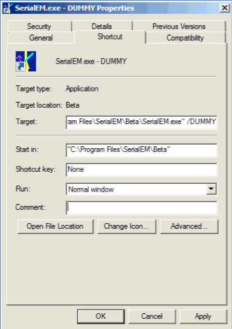
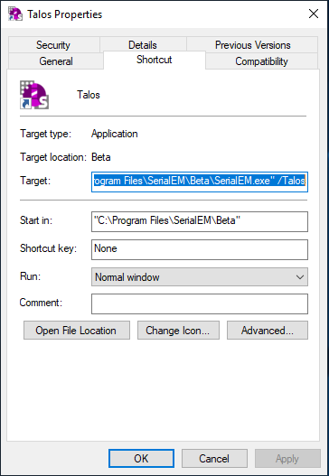

.. _SerialEM_Setup_Dummy:

SerialEM Note: Setup Dummy Instance
===================================

:Author: Chen Xu
:Contact: <chen.xu@umassmed.edu>
:Date_Created: Dec 16, 2017
:Last_Updated: May 23, 2019

.. glossary::

   Abstract
      Dummy instance of SerialEM can be very useful in two cases: 1) to be used on the same computer while main instance of SerialEM is busy
      collecting data; 2) can be used on a remote computer, e.g., a home computer to pick particles or test scripting etc.. Here I list what is needed to setup 
      dummy instance in these two cases. 
      
.. _on-the-same-omputer:

On the same computer 
--------------------

Since SerialEM is installed and working, this is very simple. 

1. make another alias (shortcut) from main instance icon. 
#. edit new shortcut's property to add "/DUMMY" at the end of the Target line, as below.

**Fig.1 Property Widows for Dummy Instance**

..   :height: 544 px
   :width: 384 px
   :alt: DUMMY instance property
   :align: center

.. _on-remote:

On a remote computer 
--------------------

1. install SerialEM onto a remote computer, as described in `Installation and Calibration <http://sphinx-emdocs.readthedocs.io/en/latest/serialEM-note-install-and-calib.html>`_. 
#. get property and calibration files from a working scope and put them in the default location C:\\ProgramData\\SerialEM, on a Windows 7 or 10 system. 
#. make a shortcut from the executable and edit the property of the shortcut to add "/DUMMY" to the end of Target line, as above. 
#. repeat the last two steps for a different scope. 

.. _multiple-dummies:

Make Multiple Dummies For Different Scopes
------------------------------------------

If we want to make multiple dummies on the same computer, say, one for Talos and one for Krios, we modify above procedure slightly different. 

1. put two sets of systems files (property and calibration files) to two folders, such as C:\\ProgramData\\SerialEM\\Krios and C:\\ProgramData\\SerialEM\\Talos. 

2. Edit both property files to insert two lines into each one.

.. code-block:: ruby

   NoScope     1
   NoCameras   1
   
3. Intead of /DUMMY, the /Krios or /Talos is used in the Target line. 

**Fig.2 Property Widows for Talos Dummy Instance**

..   :height: 544 px
   :width: 384 px
   :alt: DUMMY instance property
   :align: center

.. _on-mac:

On a Mac computer
-----------------

Thanks to Pranav Shah <p.shah.lab@gmail.com> who shared with me how he setup SerialEM on a Mac computer using Wine. It turns out
fairly strightforward, as long as you know which wine to install. The nice tutorial `Installing Wine on Mac <https://www.davidbaumgold.com/tutorials/wine-mac/>`_ written by David Baumgold is easy enough to follow.  
