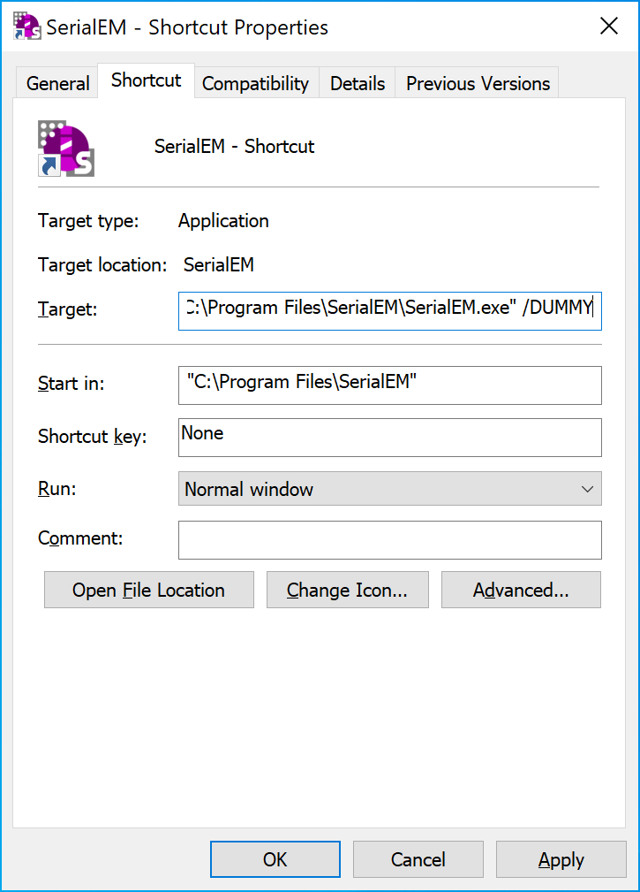

.. _SerialEM_Setup_Dummy:

SerialEM Note: Setup Dummy Instance
===================================

:Author: Chen Xu
:Contact: <chen.xu@umassmed.edu>
:Date: 2017-12-16

.. glossary::

   Abstract
      Dummy instance of SerialEM can be very useful in two cases: 1) to be used on the same computer while main instance of SerialEM is busy
      collecting data; 2) can be used on a remote computer, e.g., a home computer to pick particles. Here I list what is needed to setup 
      dummy instance in these two cases. 
      
.. _on-the-same-omputer:

On the same computer 
--------------------

Since SerialEM is installed and working, this is very simple. 

1. make another alias (shortcut) from main instance icon. 
#. edit new shortcut's property to add "/DUMMY" at the end of the Target line, as below.

**Fig.1 Property Widows for Dummy Instance**

.. _on-remote:

On a remote computer 
--------------------

1. install SerialEM onto a remote computer, as described in `Installation and Calibration <http://sphinx-emdocs.readthedocs.io/en/latest/serialEM-note-install-and-calib.html>`_. 
#. get property and calibration files from a working scope and put them in the default location C:\\ProgramData\SerialEM. 
#. make a shortcut from the executable and edit the property of the shortcut to add "/DUMMY" to the end of Target line, as above. 
#. repeat the last two steps for a different scope. 

