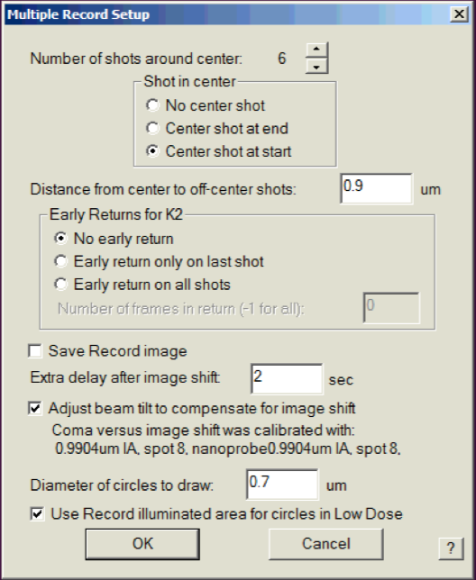

.. _serialEM-note-tacke-coma:

SerialEM Note: Tackle the Coma
==============================

:Author: Chen Xu
:Contact: <Chen.Xu@umassmed.edu>
:Date-created: 2018-3-11
:Last-updated: 2018-3-21

.. glossary::

   Abstract
      For high resolution data, coma is always a concern or something we don't want to miss or ignore.  With 
      image-beam shift, even on a carefully aligned, coma-free scope, there might always be some coma induced by the shift. 
      On the other hand, if we can collect CryoEM data with some image shift, that would increase the effciency a lot. 
      The question is how much worse the data becomes with certainly mount of image shift in the shots. A more 
      important question is if we can have a way to correct coma that is induced by the image-beam shift. 
      
      In this note, I try to explain how to assess coma induced by the shift, more or less quantitatively and how to 
      correct the coma using currently available functions in SerialEM. 
      
      This is very fresh, work in progress, both in SerialEM and this document. 
      
      
.. _background:

Background
----------

The coma we discuss here is axial coma. It is how much the incedent direction of electron beam is off from perfect optical axis. This small angle makes electron beam hitting on specimen not perpendicularly. The effect might not be easily seen visully and directly from a typical single particle electron image, but it is very real. If you look at inorganic material lattice image in electron micsocope, a tiny alpha angle change will make the lattice image no longer even and symmetic. For single particle image, this introduces a phase error becasue we assume all the images are taken with perpandicular incedent beam. It is hard or almost impossible to correct this error from all the images taken with coma, at least for single particle images. Therefore, if we can elimnate this error experimentally, that would be a good thing to do.

Align scope to minimize coma
~~~~~~~~~~~~~~~~~~~~~~~~~~~~

There are tools from microscope operating software interface. For example, in FEI Tecnai/Talos/Titan interface, there are Rotation Center and Coma-Free alignment you can use to minimize this instrument parameter. You might call this manual alignment. 

There are also seperate tools (programs) to align the scope for coma-free purpose in more automated fashion. FEI has Auto-CTF, Legion uses Zemlin plateau method to correct coma; SerialEM also has its own built-in functions to do coma-free alignment. In SerialEM, the two functions are called `BTID Coma-free Alignment <http://bio3d.colorado.edu/SerialEM/hlp/html/menu_focus.htm#hid_focus_coma>`_ and `Coma-free alignment by CTF <http://bio3d.colorado.edu/SerialEM/hlp/html/menu_focus.htm#hid_focus_coma_by_ctf>`_. One uses beam tilt induced displacement (BTID) and other uses fitted CTF information. CTF method is quick and accurate, but it does require clear Thon rings to fit. It gives options to use full 9-piece panel (Zemlin plateau) or 5-piece method. They work fairly well to my eyes. 

Linearity relationship between Image Shift and Induced Beam Tilt
----------------------------------------------------------------

With the built-in tools to correct and measure coma, it is possible to study the behavior of beam tilt induced by image shift. On a well aligned scope, image shift still introduces extra beam tilt, because the beam is no longer on axis anymore, and alignment for beam shift pivot points perhaps is never accurate enough. This is known, but the relationship between the them was not clear. 

With the lastest version, we can run following SerialEM script (this is modified from the David Mastronade's oringal one) to learn the behaviors. 

.. code-block:: ruby

   ScriptName BTvsIS
   extent = { 0.5 1.0 1.5 2.0 2.5 3.0 }
   FixComaByCTF
   Loop $#extent ind
      ReportImageShift xbase ybase
      SetImageShift $xbase + $extent[$ind]  $ybase
      FixComaByCTF 1 1
      ReportComaTiltNeeded xpxplus ypxplus
      SetImageShift $xbase - $extent[$ind]  $ybase
      FixComaByCTF 1 1
      ReportComaTiltNeeded xpxminus ypxminus
      SetImageShift $xbase  $ybase + $extent[$ind]
      FixComaByCTF 1 1
      ReportComaTiltNeeded xpyplus ypyplus
      SetImageShift $xbase  $ybase - $extent[$ind]
      FixComaByCTF 1 1
      ReportComaTiltNeeded xpyminus ypyminus
      SetImageShift $xbase  $ybase
      xpx = ($xpxplus - $xpxminus) / (2 * $extent[$ind])
      ypx = ($ypxplus - $ypxminus) / (2 * $extent[$ind])
      xpy = ($xpyplus - $xpyminus) / (2 * $extent[$ind])
      ypy = ($ypyplus - $ypyminus) / (2 * $extent[$ind])
      echo extent = $extent[$ind]  matrix = $xpx  $ypx  $xpy  $ypy
   EndLoop
   
The results obtained indicate linearity relationship between extra beam tilt (coma needed to be corrected) and image shift amount. And we also found that for fixed condition, especially beam size, the bi-linear matrix remained remarkably consistant. This provides a base for automatic correction of coma induced by image shift. 

.. note::

   The linear matrix depends on scope alignment, specially Beam-Shift pivot points. We also fount that it is sensitive to beam size.

   On FEI microscope, image shift and beam shift are linked. The "action" of image shift results in image shifting below 
   Obj lens AND beam shift above obj lens. 

Procedue to correct the coma induced by image-beam shift in SerialEM
--------------------------------------------------------------------

1. decide LD image conditions specially beam size (C2% or IA).
#. perform coma-free correction routine, SerialEM - Focus/Tune - Coma-free alignment by CTF
#. calibrate the linear matrix for current image condition, SerialEM - Calibration - Coma vs. Image Shift. 
#. save the SerialEM setting file. (yes, this calibreted matrix is saved in setting file.)
#. Setup multi-shot condition from SerialEM - Navigator - Montaging & Grids - Set Multi-shot Parameters..., and make sure the 
   check box "adjust beam tilt to compensate ..." is checked, as shown below. 
   
   **Fig.1 Setup Multi-shot and Beam Tilt Compensation**

.. note::

   There is a script command to retrieve the calibrated Coma vs ImageShift Matrix

   .. code-block:: ruby
   
      ReportComaVsISmatrix  xpx xpy ypx ypy

   It is very safe to change beam tilt this way, as beam tilt will always get restored to its original value after being corrected for 
   this specific image shift. The exception is SerialEM program crash during the multi-shot routine finishes. If that happens, which 
   is very rare, then one only needs to perform SerialEM - Focus/Tune - Coma-free alignment by CTF after restarting SerialEM. The 
   matrix saved in the setting file should be still good as long as your beam size remains the same. 

As always, for details please read the helpfile related sections. Two of them are: 

`Coma vs. Image Shift command (Calibration - Focus & Tuning sub-menu) <http://bio3d.colorado.edu/SerialEM/hlp/html/menu_calibration.htm#hid_focustuning_comavs>`_  

`Multiple Record Setup Dialog <http://bio3d.colorado.edu/SerialEM/hlp/html/hidd_multi_shot_setup.htm>`_ 
