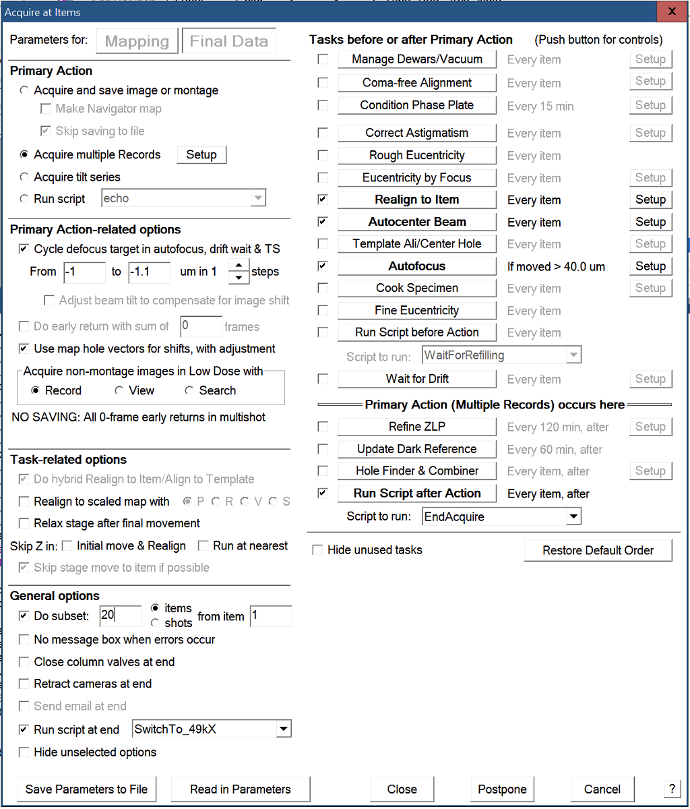

.. _early_adaption_utapi:

SerialEM Note: Take Images At Two Different Mags For A Grid 
======================================
  
:Author: Chen Xu
:Contact: <chen.xu@umassmed.edu>
:Date_Created: March 14, 2026
:Last_Updated: March 14, 2026

.. glossary::

   Abstract
      There is a need to collect images at two different magnifications for
      some of the LNP samples. For example, we like to take 20 items at
      130kX, and then 50 items at 49kX.  This is not hard to do it manually,
      but how to do this automatically without human intervention? With
      multigrid, we want to do this for each grid selected, also
      automatically. This can be very nice for screening purpose too. 

      In this note, I share what I figured out for this. 

.. _Using Imaging State:

Prepare Imaging State
---------------------

If our Low Dose areas are setup for LD_R at 130kX, and LD_V at 2000x, we
need another set of imaging states for 49kX. Say we have prepared image state
for LD_R at 49kX, and its related LD_V at 2000X, with state names as "49k"
and "V-for-49k", respectively. It not only takes care of mag, but also 
exposure time and dose etc too. So we are ready to go. 

The reason for another state at LD_V is that R and V need to be lined up. If
only switch LD_R, the new R and old V might not line up. 

.. _three places:

Three Places to Make This Happen
--------------------------------

This is Acquire dialog windows of Multigrid operation. 

..   :height: 544 px
..   :width: 384 px
   :alt: MG Acquire 
   :align: center

The first 20 items with current LD setup can be defined in 
General Option - Do subset. This part is straightforward. 

Now after 20 items are done, we need to switch to new image state
and continue Acquire. This can be done from General Option - [ ] Run 
Script at end. And you define a script like this:

.. code-block:: ruby

  ScriptName SwitchTo_49kX
  # script to load new image states and continue acquiring

  GoToImagingState 49k
  GotoImagingState V-for-49k
  StartNavAcquireAtEnd

This is a little funny. At the "end", we use a command to continue. 
So collection is going on. 

The another ending number needs to be controlled. There are maybe 
many items with A flag, but we only collect 50 items at the new mag. 
So total items to collect in total at both magnifications are 70.

We can run another script as "Run Script after Action". The script
can be something like below:

.. code-block:: ruby

  ScriptName EndAcquire
  # Report how many A has been acquired.

  ReportNavItem 
  if $navAcqIndex == 70
     EndAcquireAtItems 
  Endif 

This script is run at every item, the variable $navAcqIndex 
gives number of how many A items has been acquired. When the number is
reached, we end the acquire completely using command "EndAcquireAtItems".

