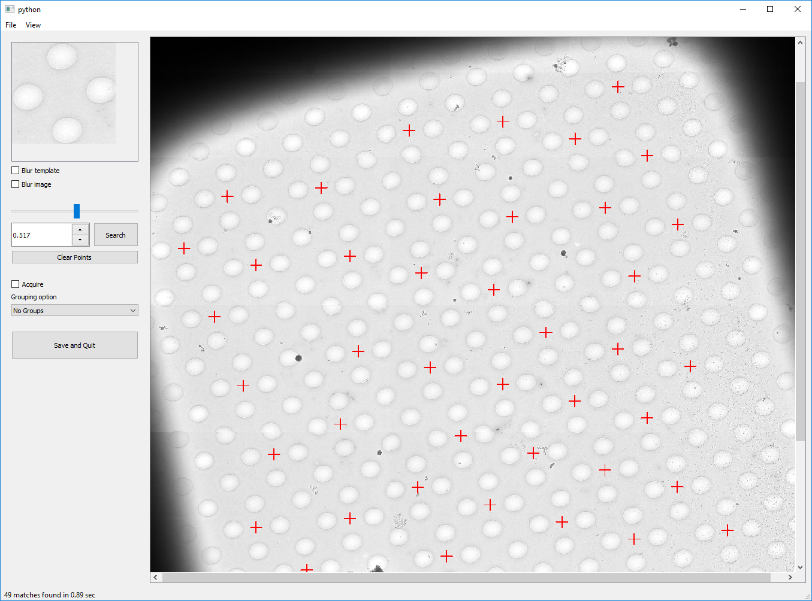
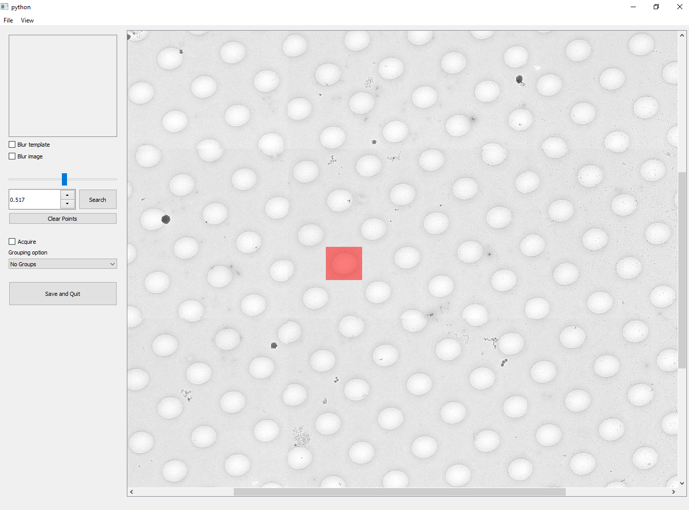
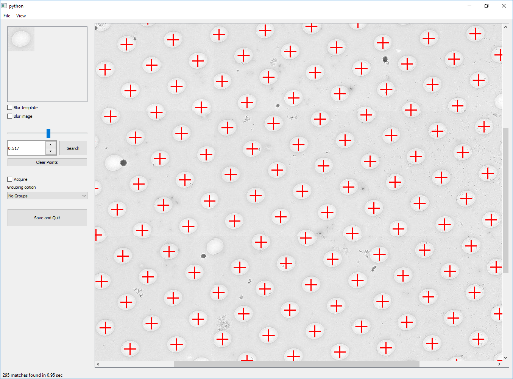

.. _SerialEM_Setup_Dummy:

SerialEM Note: Adding Point Items by Template Matching
======================================================

:Author: Albert Xu
:Contact: <albert.t.xu@gmail.com>
:Date_Created: 2019-07-25
:Last_Updated: 2019-07-25

.. glossary::

   Abstract
      This article describes a method of automatically picking points in
      SerialEM maps. Currently SerialEM does not have built-in functionality
      of adding points by correlation. However, SerialEM is now capable of
      running external Windows programs via the RunInShell script command,
      as well as merging in externally defined navigator items. This means
      that is it possible to use any external program to search for
      desirable points and add them to the navigator. As an example, I
      present a graphical tool called **semmatch** that uses
      cross-correlation based template matching. Hopefully in the future
      others will be inspired to implement their own methods and programs to
      improve the SerialEM user experience.

.. _install:

Install
--------------------

A SerialEM script called **TemplateMatch_GUI** at the end of this article is
used to launch ``semmatch``. All that is required is to install ``semmatch`` in
order to use the script. Installation instructions are on the *github* page,
https://github.com/alberttxu/semmatch

.. _usage:

Usage
------------------------------------------

1. First, select a map item from the navigator. You can double click to load
the image, or single click to simply highlight.

- Before running the script, you can optionally crop out a template in
SerialEM. See TemplateMatch_GUI for details.

2. Run TemplateMatch_GUI

|template_match2| |template_match3|

- +/- to zoom in and out.
- To crop, just click and drag.
- Change the threshold and click search until you are satisfied with the
  result.
- Click Save and Quit to merge the generated points into SerialEM. To quit
  without saving, close the window from the top.

.. code-block:: ruby

	ScriptName TemplateMatch_GUI

	### Before running this script:
	#     (Optional) Save a template of a hole/pattern as a jpg image.
	#             1. Crop a hole using ctrl+shift+drag,
	#             2. Menubar->Process-> Crop Image.
	#             3. Using the Edit/Run one Line prompt, run
	#                      SaveToOtherFile A JPG JPG T.jpg
	#

	# If something goes wrong, set Debug = 1
	Debug = 0              # True = 1 ; False = 0

	### semmatch arguments
	threshold = 0.8

	acquire = 1                                    # True = 1 ; False = 0
	groupOption = 4
		 #    0 = no groups
		 #    1 = groups based on radius
		 #    2 = all points as one group
		 #    3 = specify a certain number of groups
		 #    4 = specify number of points per group

	# names of temporary files used by semmatch
	outputNav = semmatch_nav.nav
	image = MMM.jpg
	template = T.jpg

	ReportIfNavOpen
	If $reportedValue1 != 2
		Exit
	Endif
	ReportNavFile 1
	navfile = $reportedValue1$reportedValue2
	navdir = $reportedValue3
	SetDirectory $navdir

	If $acquire != 1 AND $acquire != 0
		Echo acquire should be either 1 or 0
		Exit
	Endif

	If $Debug == 1
		debugStr = /k
	ElseIf $Debug == 0
		debugStr = /c
	Else
		Echo Debug should be either 1 or 0
		Exit
	Endif

	## load and bin MMM map
	ReportNavItem
	If $RepVal5 != 2        # if not a map item
		Echo Not a map item. Select a Map item from the navigator.
		Exit
	Endif
	MAP = $navLabel
	Echo Map Label: $MAP
	SetUserSetting BufferToReadInto 16
	SetUserSetting LoadMapsUnbinned 1
	# uncheck Montage Controls "Align pieces in overview"
	ReportUserSetting MontageAlignPieces alignChecked
	If $alignChecked == 1
		SetUserSetting MontageAlignPieces 0
	Endif
	LoadNavMap

	# reduce image if larger than 2000x2000
	maxdimLimit = 2000
	ImageProperties Q width height
	maxdim = $width
	If $width < $height
		maxdim = $height
	Endif

	If $maxdim < $maxdimLimit
		Copy Q A
		reduction = 1
	Else
		reduction = $maxdim / $maxdimLimit
		ReduceImage Q $reduction
	Endif
	Show Q

	## make a jpeg image
	SaveToOtherFile A JPG JPG $image
	Echo saved $image

	ReportOtherItem -1
	newLabel = $navIntLabel + 1

	RunInShell cmd $debugStr " "semmatch" \
	"--gui" \
	"--navfile" "$navfile" \
	"--reduction" "$reduction" \
	"--image" "$image" \
	"--template" "$template" \
	"--mapLabel" "$MAP" \
	"--newLabel" "$newLabel" \
	"--threshold" "$threshold" \
	"--groupOption" "$groupOption" \
	"--output" "$outputNav" \
	"--noBlurTemplate" \
	"--noBlurImage" \
	"--acquire" "$acquire" "

	MergeNavFile $outputNav
	If $alignChecked == 1
		SetUserSetting MontageAlignPieces 1
	Endif
	Show Q
