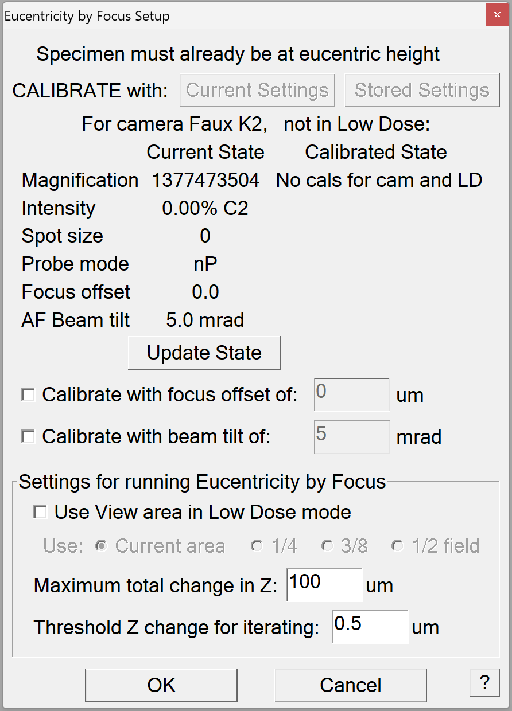

.. _SerialEM_note_eucentricity_with_beamtilting:

SerialEM Note: Eucentricity With Beam Tilting
=============================================

:Author: Chen Xu
:Contact: <chen.xu@umassmed.edu>
:Date Created: March 23, 2023
:Last Updated: March 23, 2023

.. glossary::

   Abstract
      A few years ago, I wrote a note `More About Z
      Height <https://sphinx-emdocs.readthedocs.io/en/latest/serialEM-note-more-about-z-height.html>`_.
      It describes how to use Beam Tilt method to perform eucentric height
      procedure, using a script. Since then, this beam tilting method has
      been built in and can be accessed from menu "Tasks - Eucentricity -
      Eucentricity by Focus". It is faster and more robust than scripting
      method, although the ideas behind them are very much the same. 

      In this note, I will give more thorough information about how to
      prepare to use it and how to use in Low Dose mode.  
      
.. _system_calibration:

System Calibrations 
-------------------

The procedure runs without any extra calibration. However, when one uses it
in low dose mode in which View area has large defocus offset, a couple of
extra calibrations help. 

1. Calibration - Focus & Tuning - Extended Autofocus

This can take the range way over typical range for autofocus calibration of 72
microns. For example, we do this in a range (-300 to +100 microns). This
makes autofocusing measured value more accurate for large defocus condition. 

The calibration result should be saved from menu Calibration - Save
Calibrations. 

2. A script run to get information which helps moving stage more accurately. 
It is called Non-reciprocity Calibration.

.. code-block:: ruby

   # Measures non-reciprocity between defocus measurements
   # and Z changes at a series of View offsets
   # Adjust Z offset list to stay within range of the extended focus
   # calibration
   # Make sure the beam and specimen will give good focus
   # measurements at the highest offset
           offsetArr = { 0 -50 -100 -150 -200 -250 -300 }
           zRange = 50
           backlash = 3
   
           SuppressReports
           SetLowDoseMode 1
           ReportUserSetting LowDoseViewDefocus offsetOrig
           startZ = -1 * ( $zRange / 2. + $backlash)
           MoveStage 0 0 $startZ
           MoveStage 0 0 $backlash
   
           loop $#offsetArr ind
              SetUserSetting LowDoseViewDefocus $offsetArr[$ind]
              Autofocus -1 1
              ReportAutoFocus
              if $ind == 1
                 lowerArr = $repVal1
              Else
                 lowerArr = { $lowerArr $repVal1 }
              Endif
           EndLoop
   
           MoveStage 0 0 $zRange
           Loop $#offsetArr ind
              SetUserSetting LowDoseViewDefocus $offsetArr[$ind]
              Autofocus -1 1
              ReportAutoFocus
              factor = ROUND (  $zRange / ( $repVal1 - $lowerArr[$ind] )  3)
              if $ind == 1
                 calArr = { $offsetArr[$ind] $factor }
              Else
                 calArr = { $calArr $offsetArr[$ind] $factor }
              Endif
           EndLoop
           echo Add property:
           echo ZbyGFocusScalings  $calArr
   
           MoveStage 0 0 -$zRange / 2.

The script run will spit out a line as below, which you should put in your
system property file.

.. code-block:: ruby

   ZbyGFocusScalings  0  1.015  -50  0.984  -100  0.974  -150  0.975  -200  0.972  -250  0.982  -300  0.979

For more information about the two above calibrations, please refer the
helpfile section `Extended Autofocus and Non-reciprocity Calibration for Using
Eucentricity by Focus (Priority 2) <https://bio3d.colorado.edu/SerialEM/betaHlp/html/setting_up_serialem.htm#z_by_g_setup>`_.

Session Calibration
-------------------

To use the procedure for optimal accuracy, it is recommended to do this
calibration each of your session. We normally do this with Low Dose View, 
after View parameters (C2% and focus offset) are fixed. 

This session calibration is accessed from a menu "Tasks - Eucentricity -
Calibrate Focus Targets ...". This leads to a dialog window as below. 

**Fig.1 Calibrate Focus Target dialog**

..   :height: 361 px
..   :width: 833 px
   :scale: 20%
   :alt: Calibrate Focus Target
   :align: left

Here are usually how we do it. 

1. Bring stage to eucetricity. You can do it on any sample, and you can use
stage method to get to eucentricity. You can always check how well by
comparing two shots - one at 0 and other one at say 30 degree. We normally
use LD view. 

2. With the specimen at eucentric height, click on the button "Current
Settings" in the dialog window shown above. In our case, we check the box in
front or "Use View area in Low Dose mode". 

The calibration procedure will measure how much "defocus" from the beam
tilts and that value will be used to converge to later. This value is in the
memory and will be saved in your setting file. But we usually redo this the
next session, just in case small changes in a new session (day). 

Eucentricity by Focus
---------------------

With the calibrations available, we invoke this form one of the two ways:

1. from "Tasks - Eucentricity -
Eucentricity by Focus". It will measure the "defocus" at current stage
position and adjust the Z height by converging to the "calibrated defocus"
value done as above. It uses the exact conditions for that calibration. 

2. from script command 

.. code-block:: ruby

   Eucentricity -1

That's it! You will find this is fast and very accurate. We use it almost
exclusively in our daily operations. Hope you enjoy it as we do.

