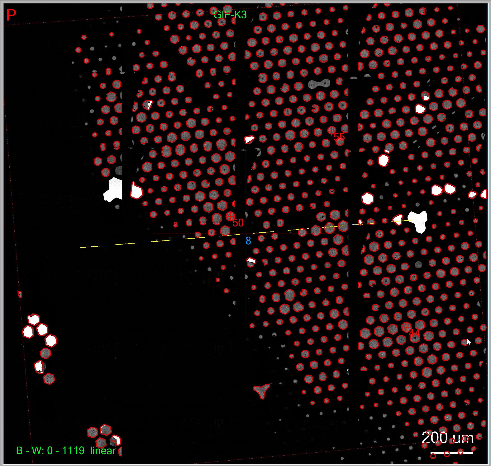
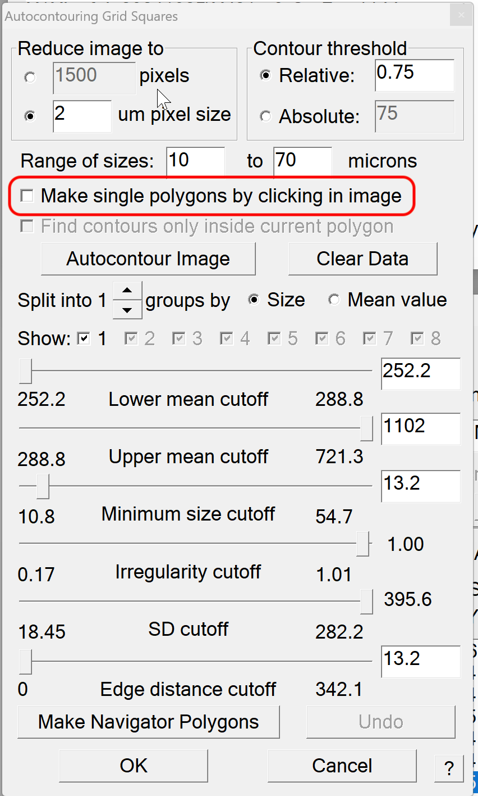

.. _SerialEM_note_add_mesh_polygon_by_single_click:

SerialEM Note: Adding Mesh Polygon by a Single Click
====================================================

:Author: Chen Xu
:Contact: <chen.xu@umassmed.edu>
:Date Created: Nov. 22, 2024
:Last Updated: Nov. 22, 2024

.. glossary::

   Abstract
      Sometimes, one wishes to be able to add a mesh polygon to LMM map quickly.
      It is alright to just add a few point items
      to the centers of wanted meshes, and then define a single polygon montage file 
      to cover them all. However, this is not ideal when the multiple meshes are 
      at different sizes. SerialEM can fit montage for each polygon to deals 
      with different sizes,  but you have to have polygons defined already. One can 
      manually add polygon for each of the meshes wanted, but it needs to click 
      multiple times to add a polygon. 

      Recently, a new feature was implemented to add mesh polygon from a single mouse
      click. Here I show you how.

.. _autocontour:

Autocontour
-----------

You perhaps already know SerialEM has Autocontour function to find multiple meshes and add
polygons. The end result is like below.

**Fig.1 Autocontour Result**

..   :height: 544 px
..   :width: 384 px
   :alt: hole finder for hex
   :align: center

The dialog for autocontour is shown here. 

**Fig.2 Autocontour Dialog**

..   :height: 544 px
..   :width: 384 px
   :alt: hole finder for hex
   :align: center

If this all works, then you can ask the same program to add a single mesh polygon.
First you make sure to check the box "Make single polygons by clicking in images".
And then you use Ctrl+SHIFT+middle to click in a mesh area. The single mesh polygon 
will be generated. You don't have to accurtely click on the very center of a mesh, 
anywhere inside the mesh will work. 

This is a special case for Autocontour function which utlize statistics info from
multiple meshes. In this special case, there is a property internally to control 
how big areas to help. 

.. code-block:: ruby

   AutocontSubareaSizeFac 
      Follow with the linear size of the region to extract for making a single polygon around 
      a grid square by clicking, as a multiple of the current setting for the maximum grid square 
      size in the Autocontouring Grid Squares dialog; the default is 6.  A smaller value will make 
      it run faster.

If you want to change from default, you can add a line in your property file

.. code-block:: ruby

   AutocontSubareaSizeFac   3

Or you can temporarily control it via script command, since this is a scriptable property

.. code-block:: ruby

   SetProperty AutocontSubareaSizeFac 3

Below is an image shown the result. 

**Fig.3 Autocontour Single Click**

.. image:: ../images/polygon-single-clickl.png
   :scale: 30 %
..   :height: 544 px
..   :width: 384 px
   :alt: hole finder for hex
   :align: center
