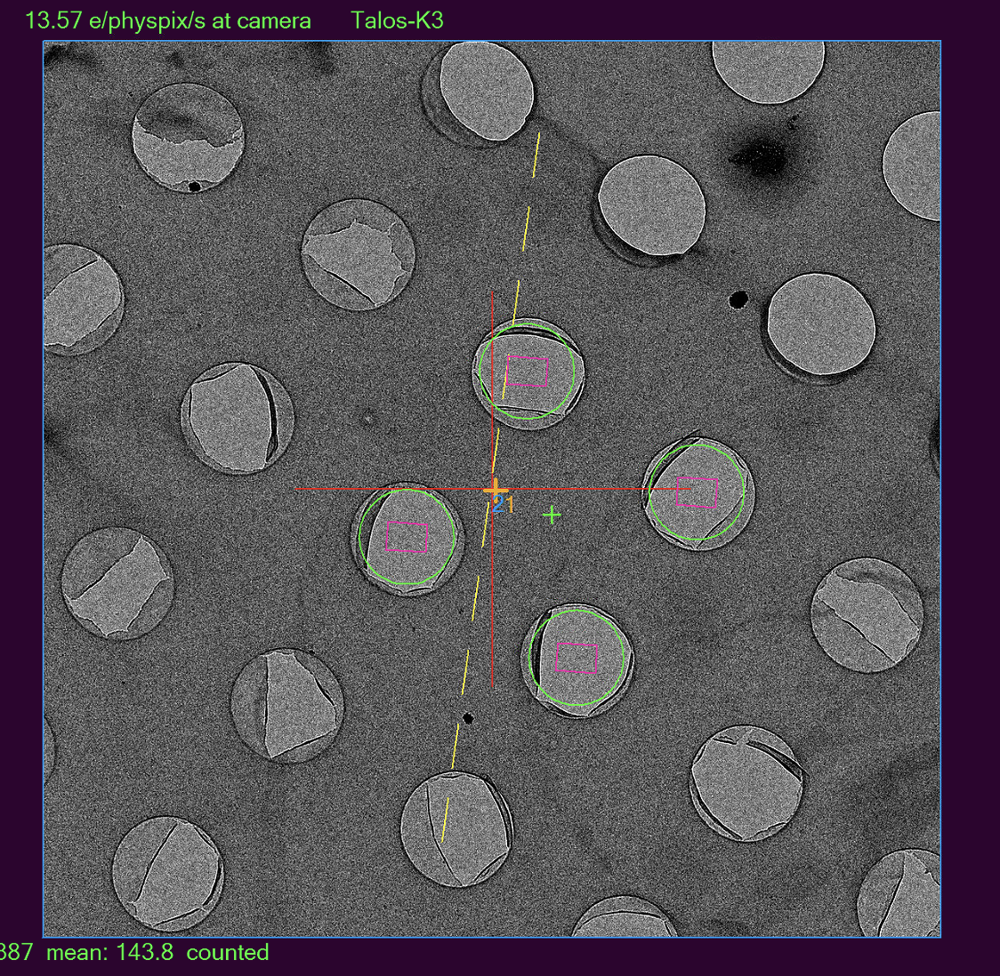

.. _alternative_center_hole:

SerialEM Note: An Alternative Way to Center a Hole
==================================================
  
:Author: Chen Xu
:Contact: <chen.xu@umassmed.edu>
:Date_Created: June 8, 2025
:Last_Updated: Oct. 5, 2025

.. glossary::

   Abstract
      If the current stage position is slightly off from the center of a 
      hole and you want to center it, a common approach is to use a hole 
      template for alignment.

      However, there is an alternative method. The hole-finding routine in 
      SerialEM is both powerful and robust. You can detect hole positions 
      and center on the closest one without using **AutoAlign** and a reference
      image. This can be done easily with a script command.

      In this note, I will share how I use this function, along with two examples.

.. _two_examples:

Two Examples
------------

**Fig.1 Center Hole Before and After**

.. image:: ../images/centerhole-before-after.png
..   :height: 361 px
..   :width: 833 px
   :scale: 50 %

The image on the left shows a typical LD_View image at 2250× magnification 
in uP mode on the Krios. The center of the hole marked with a green marker 
indicates the desired position for automatic centering.

In this case, I can simple run a script command as below:

.. code-block:: ruby

  FindAndCenterOneHole 0 1.3 0 2

This results in the hole being centered, as shown on the right. The green 
marker is for visual indication only—the procedure itself does not rely 
on it. Instead, it centers the nearest hole using Image Shift.

The command utilizes the Hole Finder function. A prerequisite is that you 
have already run the Hole Finder from the dialog window on this grid. In 
this command, 1.3 specifies the hole diameter; all other parameters are 
inherited internally from the dialog settings.

While this method works even if there is only one hole in the area, it's not 
limited to such cases. When applied to regions with many holes, it may run 
slightly slower—but even then, the delay is minimal. For a single hole, the 
operation typically takes around 0.1 seconds.

As demonstrated, this approach provides an effective alternative to hole 
template matching. During actual data collection or screening, you can use 
just two lines of script to accurately center on each hole across the grid.

.. code-block:: ruby

  RealignToNavItem 0 
  FindAndCenterOneHole 0 1.3 0 2
  ClearHoleFinder

The command directly uses the last image from the Realign routine, so 
there is no need to take another LD_View shot. It may seem almost 
magical—just make sure not to check both the "Include" and "Exclude" 
options in Hole Finder dialog, as doing so will hide the detected 
hole positions or you add a line to clear hole finder results, as shown
in script above.

This method can also be applied within the **StepTo & Adjust** dialog to 
refine Image Shift (IS) vectors for a multiple-exposure pattern. 
See the image below:

**Fig.2 Centering Hole to refine IS vectors**

..   :height: 361 px
..   :width: 833 px
   :scale: 50 %

As shown, I used 15kX as the intermediate magnification to refine the 
Image Shift (IS) vectors. At this magnification, a single hole fits 
within the field of view. With Automatic Adjustment turned on, the system 
moves to each corner hole, centers it, and sets the corresponding IS value.

In my experience, the IS determination at this magnification is sufficiently 
accurate for use at high magnifications such as LD_R at 130kX. However, 
you can further refine it by using the hole edge as a landmark after running 
the auto-adjustment at the lower magnification (15kX here).

As of June 8, 2025, the **FindAndCenterOneHole** command is available in versions 
4.2 and 4.3 testing branches, with a few bug fixes. It was initially introduced 
in 2024.

To Center to the invisible hole in the middle of 4 holes 
--------------------------------------------------------

When multishot pattern with even number like 2 x 2, 4 x 4, etc. are used,
precsiely centering to the center of 4-hole pattern is challenging, as there is no 
center hole to use. How to center to this invisible middle hole? 

**Fig.3 Centering to invisible hole of middle of 4**

..   :height: 361 px
..   :width: 833 px
   :scale: 50 %

The task here is to go to center of the "invisible" hole in the middle of 
4 holes, indicated by the green marker point. 

Recent (23-Sept-2025) implemented command can help with this task. The command is 

.. code-block:: ruby

  ReportSmallestHoleShift 0

Together with the center hole command described above

.. code-block:: ruby

  FindAndCenterOneHole 0 1.3 0 2

This task can be accomplished by a script like below:

.. code-block:: ruby

  ScriptName ToMiddle4Holes

  ## obtain multishot pattern, if not available yet.
  #FineHoles 0
  #UseHoleVectorsForMulti 0

  ## Shift to closest corner hole of the multishot pattern 
  ReportSmallestHoleShift 0 ISX ISY
  ImageShiftByUnits $ISX $ISY

  ## center the corner hole of 4
  V
  FindAndCenterOneHole 0 1.4 0 2
  ReportImageShift ISX1 ISY1

  ## shift back, twice distance to hit the opposite hole
  ImageShiftByUnits ( -2 * $ISX ) ( -2 * $ISY )

  ## center to the opposite corner hole of 4
  V
  FindAndCenterOneHole 0 1.4 0 2
  ReportImageShift ISX2 ISY2

  ## obtain middle IS values and shift to there
  finalISX = ( $ISX1 + $ISX2 ) / 2
  finalISY = ( $ISY1 + $ISY2 ) / 2
  SetImageShift $finalISX $finalISY

  ClearHoleFinder
  V

The idea is to utilize the multishot pattern available, shift to one of the corners,
center it and then shift to opposite corner hole and center it again. Thus, the middle
of the two corner holes can be obtained and it shifts to there. Only image shift (IS)
is invloved here. 
