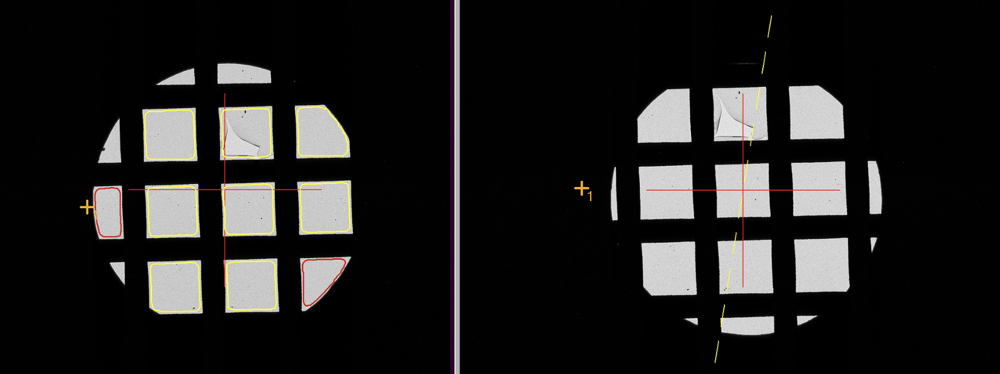

.. _alternative_center_hole:

SerialEM Note: An Alternative Way to Center a Mesh in LM
========================================================
  
:Author: Chen Xu
:Contact: <chen.xu@umassmed.edu>
:Date_Created: Dec. 21, 2025
:Last_Updated: Dec. 22, 2025

.. glossary::

   Abstract
      When we generate MMM maps, they are sometimes not well centered. 
      If you have ever wondered whether this is caused by the mesh position 
      in LM magnification being off-center—for example, due to stage error—then 
      you should make sure to correct that issue first. Of course, you can use 
      the powerful Realign routine to address this. To do so, you will most 
      likely need to temporarily increase the value of the RealignItemMaxLMField 
      property beyond its default. You may also need to switch the C2 aperture 
      back to the larger size used for the initial LMM mapping.

      Is there an alternative approach? The answer is yes. In this note, 
      I describe how to accomplish this by taking advantage of the robust 
      AutoContour functionality.

      This method is especially useful when the point you selected is not exactly 
      centered on the mesh, as it can refine the centering slightly. If your stage 
      behaves well—meaning it does not drift significantly—and your point-picking 
      is very accurate, you may not need to use this method.

.. _center_mesh:

Center a Mesh
-------------

**Fig.1 Center A Mesh Before and After**

The image on the left shows a typical LM image taken with a small C2 aperture, 
on which AutoContour can be run easily. After processing the meshes, the one 
closest to the stage center is identified and the stage is moved to that position. 
The image on the right shows the result after running the script. This method is 
direct and straightforward.

The concept is simple:

#. Move the stage to a mesh item, then run AutoContour again using the most inclusive parameters.
#. Save the detected contours to navigation items.
#. Go through each navigation item to determine which one is closest to the current stage position.
#. Move the stage to that item. 

.. _the_script:

The Script
----------

For centering a hole, there is a script command "FindAndCenterOneHole".  There is no similar command for 
mesh yet. However, this can be accomplished using scripting. The script, as I call it **FindAndCenterOneMesh** 
is fairly simple as shown below:

.. code-block:: ruby

  ScriptName FindAndCenterOneMesh
  # script to draw mesh polygon and move to closest one
  
  # Assume buffer A has an LM image, crop to smaller area
  # to save time, not always neccesary.
  #Search          
  CropCenterToSize A 2000 2000      
  
  # get current stage pposition
  ReportStageXYZ X0 Y0
  
  # Contour
  AutoContourGridSquares A 2 0.5 0.4
  
  # last item before AutoContour
  ReportOtherItem -1
  Index0 = $NavIndex 
  
  # make nav point and get the new last one
  # [#L] [#U] [#M] [#S] [#I] [#B]
  MakePolygonsAtSquares 2553 3175 39.3 0.91 696.9 
  ReportOtherItem -1
  Index1 = $NavIndex

  # how many meshes found and made into nav items
  len = $Index1 - $Index0
  
  # define arrays for distance and index
  NewArray DIS -1 $len
  NewArray RIG -1 $len
  
  # go throught all the polygon items just generated
  Loop $len ind
     Index = $index0 + $ind
     ReportOtherItem $index
     X1 = $repVal2
     Y1 = $repVal3
     # distence 
     DIS[$ind] = SQRT ( ( $X1 - $X0 ) *  ( $X1 - $X0 )  +  ( $Y1 - $Y0 ) *  ( $Y1 - $Y0 ) )
     RIG[$ind] = $index
  
     # Obtain minimum value
     If $ind == 1
        W =  $DIS[$ind] 
     Else 
        W = MIN $DIS[$ind] $W
     Endif
  EndLoop 
  
  # Now array is available, find the index for the minimal distance
  Loop $len ind
     if $DIS[$ind] == $W
        index = $RIG[$ind]
     Endif
  EndLoop 
  
  # now move to it
  ReportOtherItem $index
  MoveStageTo $repVal2 $repVal3
  
  # delete the polygons after moving
  Loop $len ind
     DeleteNavigatorItem -1
  EndLoop 

  # Take a look 
  Search
