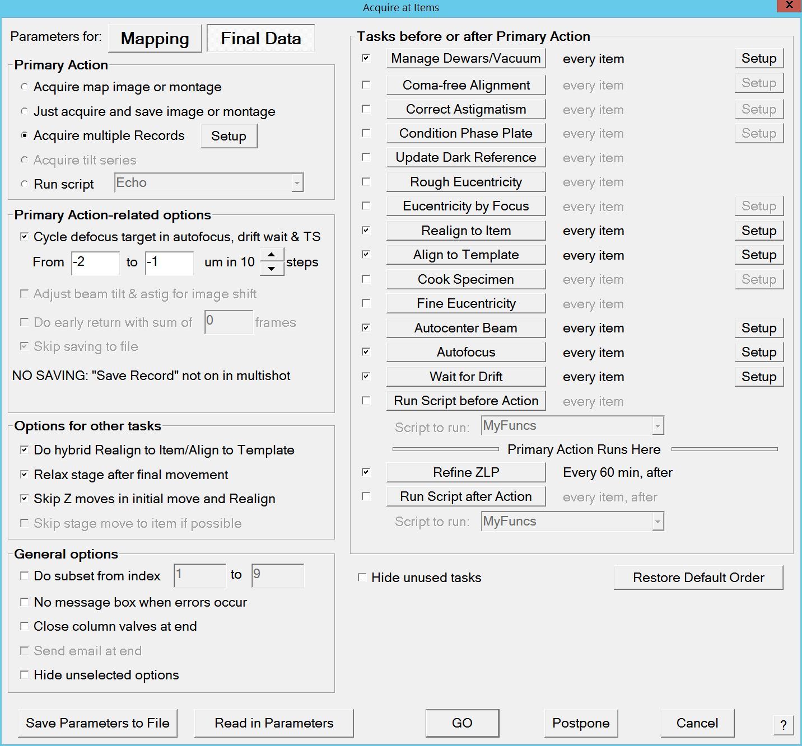
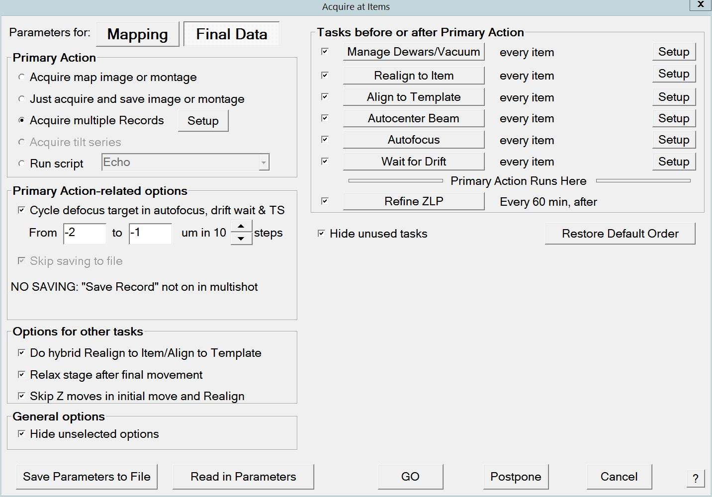

.. _scriptless_control:

SerialEM Note: Scriptless Control
=================================

:Author: Chen Xu
:Contact: <chen.xu@umassmed.edu>
:Date_Created: 2021-09-18
:Last_Updated: 2021-09-18

.. glossary::

   Abstract
      Since 4.0, sophisticated control without scripting has become possible. In this note, I give an example with some explanation how to do
      this for a typical single particle data collection. 
      
      
.. _background:

Background Information
----------------------

There are basically two new features available in version 4.0. 

1. Adjust Eucentric Height using tilted beam.

2. Flexiblly arrange helping tasks and primary actions from "Acquire at Items" dialog window, without a script. 

In the past, a sophisticated script is need to control pipeline of actions for single particle data collection. Typically, the actions may include
eucentric height positioning, X-Y positioning, beam centering, aufofocusing within a range, drift control and final image taking. It is now possible 
to arrange these actions without scripting in the new version. 

.. _dialog:

The New "Acquire at Items" Dialog Window
----------------------------------------

Below is the new full dialog window.

**Fig.1 Full Dialog Window - Acquire at Items** (click for full size image)

Yes, it looks quite different from previous versions. Here are a few:

- Left side of the windows is for Primary actions and bunch of options. Right side is for helping tasks to be selected and setup to use. 
- Multiple Shot is new on primary action list compared to before. 
- For each task on the right side, there are three things to set. 

   1. checkbox to enable/disable the task.
   2. task push button to configure order and how often the task is run.  
   3. "setup" button to engage actual conditions. 

- non-selected options (on left) and tasks (on right) can be hidden respectively, to make the window neater and more focused. 

.. _dialog_brief:

An Example Configuration for Single Particle
--------------------------------------------

If I hide the non-selected, I get a short, more focused dialog windows like below.

**Fig.2 Configured Dialog Windows - an exmaple** (click for full size image)

   
This setup can completely replace scripting for our single particle data collection pipeline. 

.. _extra_notes:

A Couple of Extra Notes
-----------------------

1. if the "Cycle defocus..." under "Primary Action-related Options" is checked, the target defocus will change for every "Acquire at Items" cycle run. There is no longer needed to have a script for the cycling target defocus. 

2. If "Realign To Item" and "Align to template" both are checked, normally, it will perform full routine of "realign to item" first, then followed by a template aligning using pre-defined template from its "setup". If the option "Hybrid..." is also checked, the 2nd round of realign will be skipped and replaced by the template aligning. This saves a few seconds. However, when the stage is not very reliable or when the template area is fairly small, it works better without "Hybrid..." being used. 

   
