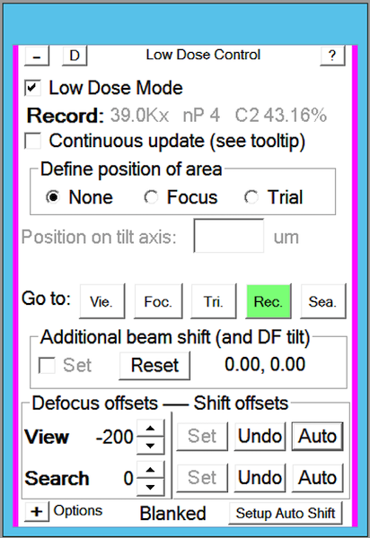
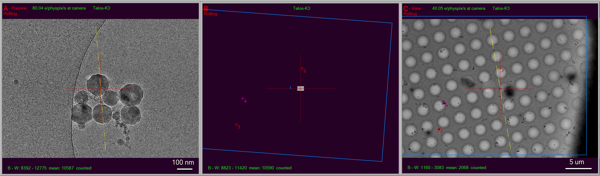
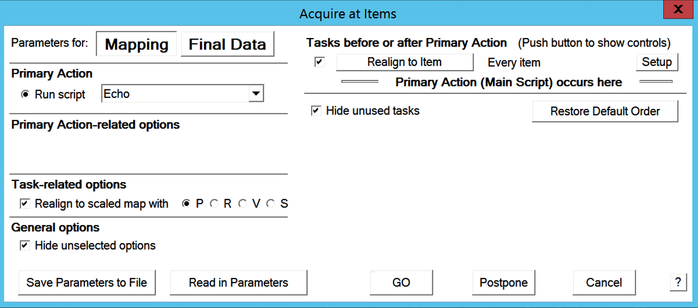
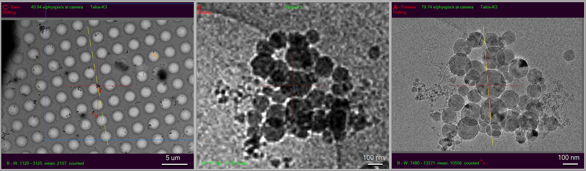

.. _SerialEM_note_cross-mag_alignment:

SerialEM Note: Cross-mag Alignment
==================================

:Author: Chen Xu
:Contact: <chen.xu@umassmed.edu>
:Date Created: March 7, 2024
:Last Updated: March 7, 2024

.. glossary::

   Abstract
      Cross-mag alignment functions has been recently implemented since
      around beginning of 2024. It allows one to align two images at very
      different magnifications, and it takes into consideration of scale and
      rotation. 

      There are a few scripting commands available related to this
      function. This routine should for more general purpose when different
      magnifications are involved. Here I give two applications examples
      that was built upon this cross-mag alignment function.  

.. _Set_LD_IS_automatically:

Set Image Shift Offset for LD View or Search Automatically
----------------------------------------------------------

The late Testing branch has a new look for Low Dose Control panel, as shown
below.

**Fig.1 New Low Dose Control Panel**

..   :height: 544 px
..   :width: 384 px
   :alt: new LD looking
   :align: center

This new design re-arranged Offset portion. It seems to be more intuitive
for offsets of Image Shift and Defocus, for both View and Search areas.
Moreover, it has a ``Auto`` button for Is offsets now. 

This is how it work. If you take a Record or Preview image with some clear
feature in it, you click on ``Auto`` button. The program will transform this 
image to scale down to match magnification of View and align it to View
images for the same feature. This results in image shift offset be set
accurately. 

**Fig.2 Images for shrunk Preview and View**

..   :height: 544 px
..   :width: 384 px
   :alt: new LD looking
   :align: center

In above figure, the first image on the left - "A buffer" is from a Preview.
The image in the middle is a scaled down one of it based on the View mag. You can
see the FOV is small compared to a real View image which is on the right. By
alignment these two images at now the same maginifications / pixelsizes, the
procedure determines IS offset for View and take it in. 

.. _Realign_a_feature_in_view_to_P:

Realign a Feature in View map to Match Preview/Record
-----------------------------------------------------

Realign routine now can take advantage of this cross-mag alignment feature.
With this feature, Realign is able to bring the target to the center of
camera of higher mag of original map. 

**Fig.3 Option for Realign to Scaled map**

..   :height: 544 px
..   :width: 384 px
   :alt: new LD looking
   :align: center

This feature can be accessed from scripting command. If you run "Acquire at
Items", it can be activated from the option for Actions on the left column,
as shown in above figure. 

In this case, after a typical two rounds of aligning at View map, it them
scaled up the portion of the map to match final higher mag (Preview or P in
this case). 

**Fig.4 Scaled up Realign - ideal for initial target in TS**

..   :height: 544 px
..   :width: 384 px
   :alt: new LD looking
   :align: center

In above figure, the first image on the left has a feature centered after
normal Realign to Item, it is the scaled up this portion of the map to match
the higher mag, as shown in the middle. The routine then aligns the real
Preview image (on the right) to this transformed one in the middle. So the
target is centered at Preview mag. This is ideal for initial targeting for
tilting series. 

As you can see, even your low dose image shift offset for View might have
not adjust perfect, this procedure still can bring the final mag target to
the center. This is indeed very convenient! 
