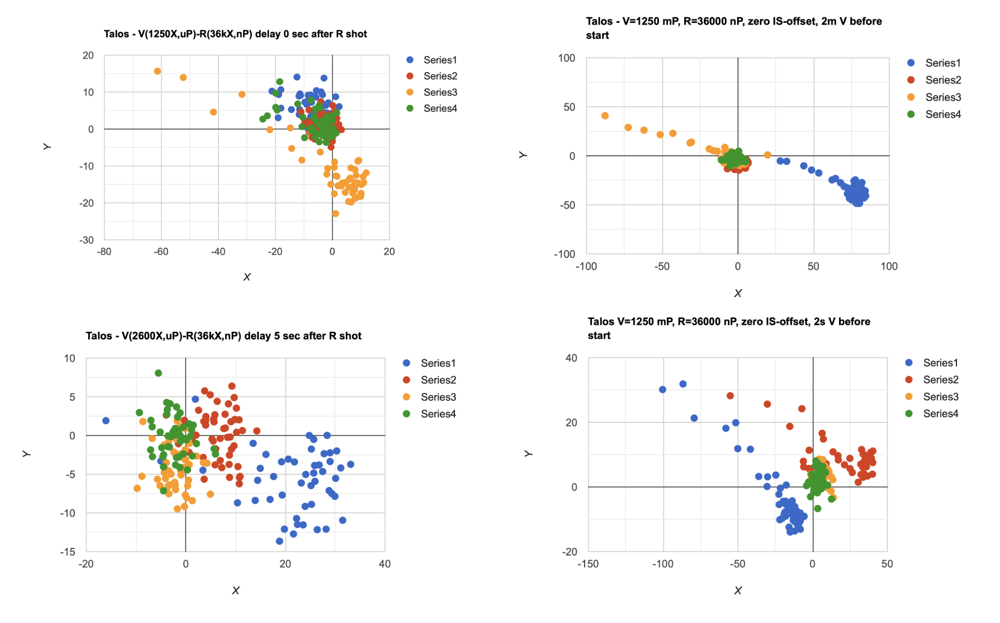
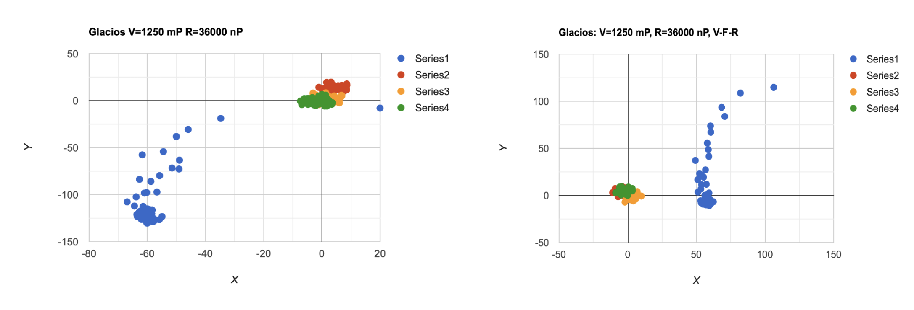

.. _debug_beam_instability:

SerialEM Note: Debug Beam Instability
=====================================
  
:Author: Chen Xu
:Contact: <chen.xu@umassmed.edu>
:Date_Created: May 31, 2025
:Last_Updated: May 31, 2025

.. glossary::

   Abstract
      There are frequent discussions about which software is best for controlling the microscope 
      during cryo-EM operations. One common criticism of SerialEM is that it presents too many 
      details for new users to learn. However, great functionality and flexibility often come 
      with complexity. Personally, I believe this is what makes SerialEM so powerful.

      In this note, I share my experience debugging a beam instability issue on the Talos Arctica. 
      I used only two script commands to collect quantitative data—demonstrating how SerialEM can 
      serve as a convenient tool for various types of investigation, thanks to its flexibility. 

.. _background_info:

Background Information
----------------------

Since the installation of the Talos Arctica, we've noticed that the beam appears somewhat unstable. 
It tends to shift when returning from lower magnifications—even those above the low magnification 
(LM) range. The beam seems to stabilize after remaining at a single magnification for a longer period. 
We consulted Thermo Fisher engineers to investigate the issue, but the results were inconclusive.

This instability hasn't prevented us from routine screening and data collection at good resolution. 
However, we remain curious whether the issue stems from a problem in the lens system or if we’re 
simply comparing it—perhaps unfairly—to the Krios. To approach this question more scientifically, 
we need quantitative data.

.. _experiment:

Experiment
----------

We set up Low Dose conditions with LD_View at 1250× in uP mode and LD_Record (LD_R) at 36,000× in 
nP mode. The LD_R beam was adjusted to be small enough so the entire beam could be captured in a 
single LD_R exposure using the Ceta camera.

We began with the LD_R beam and centered it using the script command **CenterBeamFromImage**. Then, 
we cycled between LD_View and LD_Record modes for 50 iterations. During each cycle, we used the 
script command **MeasureBeamPosition** to record the X and Y position of the LD_R beam—without 
re-centering it. This X-Y pair represents the displacement of the beam from the center.

We repeated this process four times and plotted the data to visualize the beam movement.

The script we used is fairly simple, as below:

.. code-block:: ruby
  :caption: script TestBeamStability

  ScriptName TestBeamStability

  echo V=1250 mP R=36000 nP V-F-R-V Similar P1   
  echo ---------------------------------------- 
  
  Loop 4
      
    cycle = 50
      len = $cycle * 2
       
      NewArray X 0 $cycle
      NewArray Y 0 $cycle
      NewArray XY 0 $len
   
      #GoToLowDoseArea V 
      #Delay 2 s 
  
      R
      CenterBeamFromImage 
      
      Loop $cycle ind
        echo ind = $ind 
        ResetClock 
        
        GoToLowDoseArea V
        Delay 0 s
        #GoToLowDoseArea F
        R
        Delay 0 s
        MeasureBeamPosition 
  
        X[$ind] = $repVal1 
        Y[$ind] = $repVal2
        even = $ind * 2
        odd = $even - 1
        XY[$odd] = $repVal1
        XY[$even] = $repVal2
        ReportClock 
      EndLoop

      Echo X = $X
      Echo Y = $Y
      Echo XY = $XY
      echo ---------------
  EndLoop 

I also used array function to handle the data more conveniently. In the end 
or each run, I got some data points as below.

.. code-block:: python

   X = -0.28772  7.609619  0.635071  3.970154  3.47998  8.763306  6.890381  8.362732  -3.947632  10.44873  10.689026  4.016235  9.817993  8.887207  3.590088  5.24231  10.75769  7.209595  10.881104  9.042969  5.572937  5.867554  3.767334  4.01123  9.651489  5.485962  10.138306  6.00708  9.137207  8.539063  10.723938  6.897827  2.552856  1.219299  4.884705  -1.502319  2.028076  10.171875  6.290161  8.746338  14.237305  7.865112  5.813354  8.681885  11.348022  7.924805  9.232422  3.668091  5.643311  9.69635
   Y = 1.960083  0.892212  -2.176086  1.343628  -2.82959  -5.4104  -0.38324  -0.227539  2.638794  -4.014343  2.027588  2.454956  2.062866  -0.194611  1.811951  -0.455292  -5.424896  -4.145447  -5.28772  1.782349  2.113403  -3.792603  5.762878  1.963867  -1.332825  -0.715271  3.53418  -1.726135  -1.778625  4.091919  -6.234741  -3.225586  3.262817  -0.461731  5.255127  -1.068512  0.04248  0.416626  4.406494  -2.533905  0.589722  2.744873  2.673828  -3.733795  0.639038  0.966675  6.378662  -5.641052  1.754517  4.903931
   XY = -0.28772  1.960083  7.609619  0.892212  0.635071  -2.176086  3.970154  1.343628  3.47998  -2.82959  8.763306  -5.4104  6.890381  -0.38324  8.362732  -0.227539  -3.947632  2.638794  10.44873  -4.014343  10.689026  2.027588  4.016235  2.454956  9.817993  2.062866  8.887207  -0.194611  3.590088  1.811951  5.24231  -0.455292  10.75769  -5.424896  7.209595  -4.145447  10.881104  -5.28772  9.042969  1.782349  5.572937  2.113403  5.867554  -3.792603  3.767334  5.762878  4.01123  1.963867  9.651489  -1.332825  5.485962  -0.715271  10.138306  3.53418  6.00708  -1.726135  9.137207  -1.778625  8.539063  4.091919  10.723938  -6.234741  6.897827  -3.225586  2.552856  3.262817  1.219299  -0.461731  4.884705  5.255127  -1.502319  -1.068512  2.028076  0.04248  10.171875  0.416626  6.290161  4.406494  8.746338  -2.533905  14.237305  0.589722  7.865112  2.744873  5.813354  2.673828  8.681885  -3.733795  11.348022  0.639038  7.924805  0.966675  9.232422  6.378662  3.668091  -5.641052  5.643311  1.754517  9.69635  4.903931

With that, I can plot them out to visualize the movement. 

.. _plot_result:

Plotting Results
----------------

I found an online plotting website which fits my purpose of plotting well. 
https://www.rapidtables.com/tools/scatter-plot.html. I coped & pasted the 
XY pairs into webpate and got nice plots. Below are some of the plots
from Talos and Glacios. 

**Fig.1 Beam Movement Talos**

..   :height: 361 px
..   :width: 833 px
   :scale: 50 %
   
**Fig.2 Beam Movement Glacios**

..   :height: 361 px
..   :width: 833 px
   :scale: 50 %

It seems that the beam stabilizes after some time. However, if the cycle 
is paused for a while—whether in LD_V or LD_R—the beam tends to drift 
when the cycle resumes. This behavior appears to be related to a dynamic 
equilibrium, likely caused by thermal changes in the lenses and coils. 
While the Glacios appears to be marginally more stable, its behavior 
remains largely comparable to that of the Talos.
