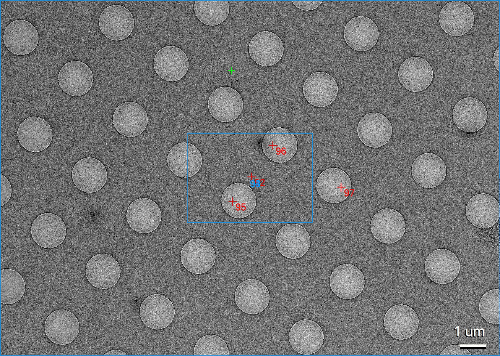
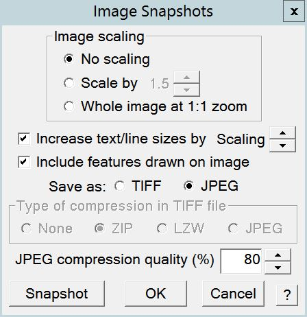
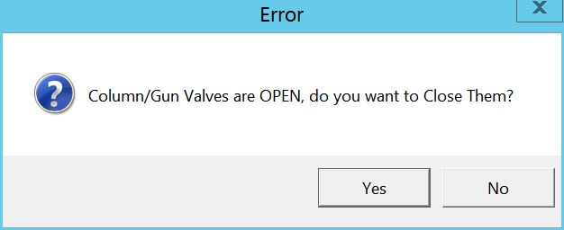

.. _serialEM-note-hidden-goodies:

SerialEM Note: Hidden Goodies
=============================

:Author: Chen Xu
:Contact: <Chen.Xu@umassmed.edu>
:Date-created: 2020-11-21
:Last-updated: 2021-03-25

.. glossary::

   Abstract
      One of the amazing things about SerialEM, to me, is that I almost always
      find some cool functions and features which I did not use before. It
      could be also true for some other users, even you might not regard yourself
      as a novice user. If you see someone using it, you immediately get
      it. Otherwise, you might not realize that the cool function exists. 

      In this note, I want to give a few examples to show some of the hidden
      beauties I like a lot. And I hope you can learn them from reading this
      note if you don't know yet. Hopefully, the example list can grow longer
      with time and more exploration. 
      
.. _example_1:

Example 1 - delete multiple nav items at once
---------------------------------------------

This might not sound anything special, as you can use the ``Delete`` button
on Navigator window easily, and you just click on the button when the item
is highlighted, and you do this multiple time to delete a bunch of items.
However, if you want to delete a series (a lot of points) items that do not 
belong to a single group or are only part of a group, this might become a 
little troublesome. 

Here is a trick - to use SHIFT-D for this: you first click on the first item
to be removed and press SHIFT-D, then you click on the last item and press
SHIFT-D again; this will remove all the items in the range regardless their
group properties. 

You might find there are many hot keys available which you did not pay
attention before.

https://bio3d.colorado.edu/SerialEM/betaHlp/html/about_mouse.htm

.. _example_2:

Example 2 - make multiple polygon montage maps at once
-------------------------------------------------------

Your reaction might be that you already well know how to do this. Indeed,
this can be done with steps below:

1. Open a polygon montage map file via menu *Navigator - Montaging &
   Grids - Setup Polygon Montage*.
2. Add point items to all and each of the montage positions to be acquired,
   and give them flag "**A**". 
3. *Navigator - Acquire at points - Acquire Map Image or Montage*.

One of the nice key things here is that once the montage map is open and current,
the program knows how to make montage for each of the positions. The montage
setup dialog is only set once. Because all the items share the same
file, there is no need to draw multiple polygons at different locations. 

We also do this very often. We collect all the good meshes to make them into
montage maps so we can pick and realign to each positions later. However, there are a
couple of things we don't like with this way: 

- The super-stack file for all the montages can be very large. It is not handy to look at a particular mesh off-line. 
- The section # of the file is from 0,1... to the last one, they are directly linked with mesh label/numbers. 

It would be really nice to make all the meshes to have their own separate files and
with the mesh ID in the filenames, something like *Grid3-Mesh8.map*. This way,
we can check each mesh map easily when off-line. On a windows computer
with 3dmod installed, this is as simple as double clicking on the filename. 

How to do that? Not so easy anymore? If you don't already know, here is how:

1. add a polygon item as you normally do. 
#. make sure this polygon item is above of all and any mesh point items
   you already add. You do this by left mouse dragging the polygin item UP.
#. *Navigator - Options - Use Item Labels in Filenames*.
#. With polygon item highlighted, check the boxes before "Acquire (A)" and "New file at
   item". 
#. In the pop-up "Property of File to Open" dialog window, select "Montaged
   Images". And check both boxes before "Fit montage to polygon" and "Skip
   montage setup dialog when fitting in future". 
#. Input in the pop-up montage setup dialog window.
#. Input your string, e.g. "Grid3-Mesh" in the filename dialog, click
   ``Save``.
#. Now highlight the mesh item you want to make map, check "Acquire (A)" and
   "New file at item". 
#. repeat for all the mesh items. 

After you do Navigator - Acquire at Point, you will get multiple files such as 
*Grid3-Mesh3.map, Grid3-Mesh4.map, Grid3-Mesh15.map* etc.. Very nice, isn't it?

Here each mesh map will have its own filename. During collection, the filenames 
are opened and closed for each item. The setup step uses **heritage** function which 
is also quite hidden. 

.. tip::

   To obtain filename with MapID and ItemID in the filename string, here is a tip:
   
   .. code-block:: ruby

      ReportNavItem 
      NavIndex = $repVal1
      pt_label = $NavLabel

      NavIndexItemDrawnOn $NavIndex
      ReportOtherItem $repVal1
      map_label = $NavLabel

      filename = $map_label-$pt_label

.. _example_3:

Example 3 - make snapshot with nav features
-------------------------------------------

We already know SerialEM script has a command to make a snapshot of an image
in a buffer and save it in JPG format. But that doesn't include any nav
items drawn or a scalebar. A snapshot function with possibility of
including navigator items drawn and a scalebar can be very useful sometimes.

For example, in a screening session, we make a mesh montage map and pick a
new point items on the map from different areas. Before or after we take all
the images from these point items, it would be really cool to have a
snapshot map image with all the points drawn on it. It can be very useful 
for us to track the image quality with ice conditions etc., because we know 
which image is from which area in the map. 

Something like an image below:

**Fig.1 An example snapshot** (click for full size image)

This function has been implemented fairly recently. It has a small GUI tool window 
and a script command for this task. You can open this tool window from *Window - Take Image Snapshot...*.

**Fig.2 Snapshot Tool Window** (click for full size image)

There is also a command which can be used like this:

.. code-block:: ruby

   SnapshotToFile 1 1 1 JPG JPG snap.jpg

For more complete information about this little function, please check helpfile section:

https://bio3d.colorado.edu/SerialEM/betaHlp/html/hidd_screenshot.htm

and command usage description. 

.. _example_4:

Example 4 - Run script at SerialEM program start or exit
--------------------------------------------------------

This is a new feature in 3.9 beta. It can be very handy if you have some
tasks to do when you startup and exit. For example, you might want to get into
Low Dose mode and clear some persistent variable from last run. Or you have 
some other tasks to do when you quit SerialEM program. 

You can setup it from menu *Script - Run at Program Start ...* or *- Run at
Program End...*, and define a script accordingly. Here I give two examples
- one to define current working directory in the startup and one to make sure 
column and gun valves be taken care of.

Below script running at program start will pop up a file chooser to ask you 
define the current working directory. 

.. code-block:: ruby

   ScriptName StartUp
   # script to run when starting SerialEM program

   #SetLowDoseMode 1
   #GoToLowDoseArea V

   SetDiectory X:\
   UserSetDirectory 
   Echo -----------
   ReportDirectory 
   Echo -----------
   OpenChooserInCurrentDir

Here is my little script to run at end.

.. code-block:: ruby

    ScriptName EndingScript

    # script to run when exiting SerialEM program
    
    ReportProperty NoScope noscope           # determine on Dummy or not
    If $noscope == 0
      ## Close Column/Gun Valves if they are OPEN
      ReportColumnOrGunValve
      If $repVal1 == 1    # open
         YesNoBox Column/Gun Valves are OPEN, do you want to Close Them?
         If $repVal1 == 1 # answer Yes
           SetColumnOrGunValve 0
           Echo ------ Now Valves are CLOSED! ------
         Else
           Echo Valves are still OPEN!
         Endif
      Else
         Echo Already closed!
      Endif 
    Endif

The window below will pop up when exiting SerialEM so you will never forget about this. 

**Fig.3 YesNo Window** (click for full size image)

Clicking on ``Yes`` will close the valves and ``No`` will keep them open. 

.. _example_5:

Example 5 - Script With Python
------------------------------

Around March 23, 2021, scripting also supports python. SerialEM native collection of commands act like a module. Here is an example 
of the same CycleTargetFocus function in Python code. 

.. code-block:: python

   #!Python
   #ScriptName CycleTargetDefocus
   import serialem

   def CycleTargetDefocus(low, high, step):
      serialem.Echo('=>running CycleTargetDefocus ...' + 'range are (' + str(low) +', ' + str(high) + '), step is ' + str(step))
      delta = -1 * step
      serialem.ReportTargetDefocus()
      tarDef = serialem.GetVariable('repVal1')

      if float(tarDef[0]) > -1.0 or float(tarDef[0]) <= -3.0:
            serialem.SetTargetDefocus(low)
      else:
            serialem.IncTargetDefocus(delta)
            serialem.ChangeFocus(delta)

   ## run it 
   CycleTargetDefocus(-1.0, -3.0, 0.1)

    
