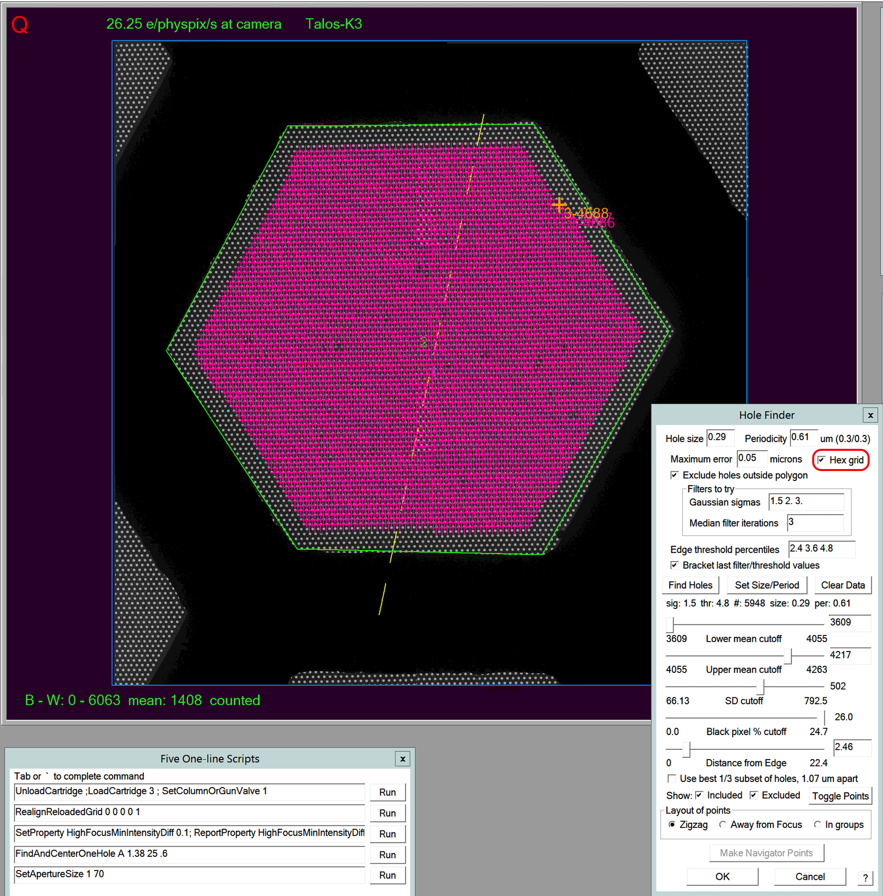
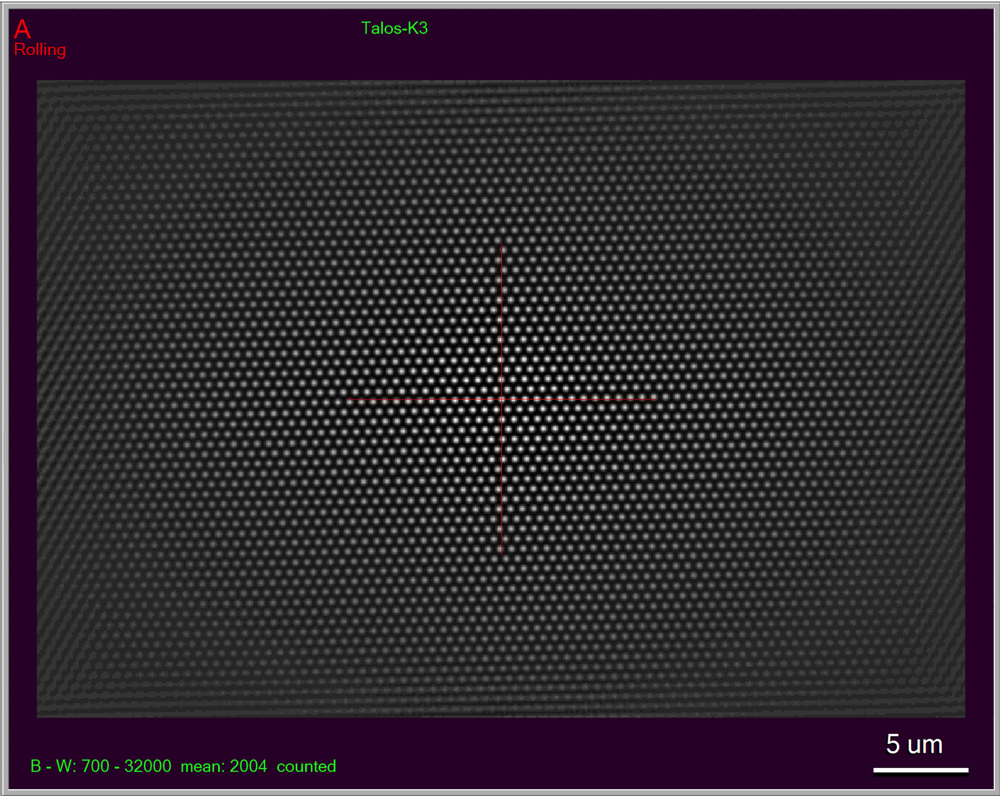
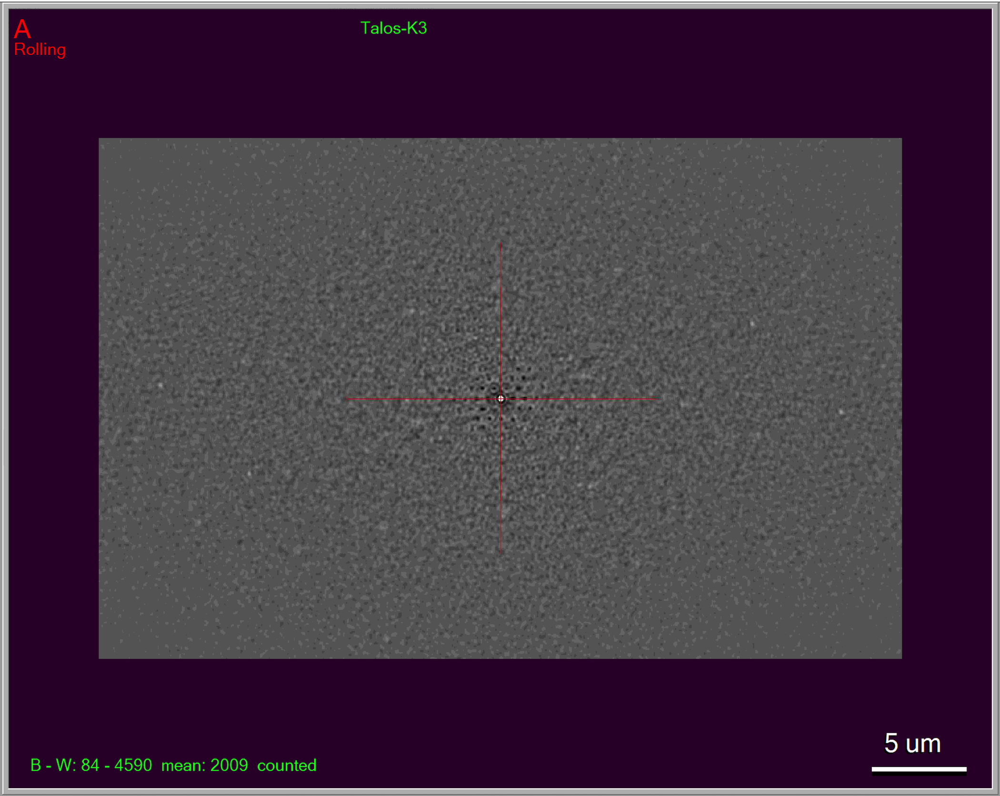

.. _SerialEM_note_cross-mag_alignment:

SerialEM Note: Work With A Hex Grid
===================================

:Author: Chen Xu
:Contact: <chen.xu@umassmed.edu>
:Date Created: Nov. 22, 2024
:Last Updated: Nov. 22, 2024

.. glossary::

   Abstract
      Quantifoil released their new type of cryo grids - HexAuFoil. Both
      mesh shape and hole pattern arrangement in the meshes are hexagon. It 
      has small holes and hole spacing. SerialEM has to develop some new 
      features to deal with this. 

      Here I share some of our experience how to control hex grid using SerialEM.

.. _hole_finder_hex:

Finding Holes for Hex grid
--------------------------

For hex, finding holes is similar to finding holes for a typical sqaure shaped
hole pattern. But here you check the box next to "Hex grid", as shown in red outline
in the image below. 

**Fig.1 Hole Finder for Hex**

..   :height: 544 px
..   :width: 384 px
   :alt: hole finder for hex
   :align: center

.. _multiple_exposure_hex:

Multiple Exposure Setup for Hex
-------------------------------

And of course you need to setup multiple exposure accordingly. 

**Fig.2 Multiple Exposure for Hex**

.. image:: ../images/multi-exposure-hex.png
   :scale: 20 %
..   :height: 544 px
..   :width: 384 px
   :alt: hole finder for hex
   :align: center

In above image, in multiple exposure setup dialog, you need to check "Hex grid" here too. 
If you click on button [ Last Hole Vectors ] or [ Map Hole Vectors ], you will obtain Image
Shift vectors that are the base to define a multiple exposure pattern. There is 
under-the-hood conversion from hole Stage geometry vectors to Image Shift vectors. 

After finding holes, even you do not take any holes, the hole vectors become available. 
Those are the hole stage vectors. If it is an overview image of a map on which you use [ Map Hole Vectors ], 
it will not only convert them to image shift vectors (they are available in memory immediately), but 
also add two entries in nav file for that map item for hole vectors. So the map item will have
this information in it. After nav file is saved, you can see the two entries for a map item as below. 

.. code-block:: ruby

   ...
   HoleISXspacing = -0.264893 -0.995153 -0.73026
   HoleISYspacing = 0.997737 0.284396 -0.713341
   ...

This would potentially help automation and for cases like geometry of 
holes having changes slightly from mesh to mesh and you have to obtain the image shift vectors
dynamically.

Please note, the final image shift vectors used for data collection at high mag might be slightly 
different from freshly converted ones from MMM mag due to impefection by crossing such large mag distance. 
You should refine the final image shift vectors before committing massive collection. 

The image shift vectors and how many rings for hexagon together define the actual multiple exposure 
pattern. Here how much of the maximum shift value for a pattern size should be considered. 

Once the pattern is defined, you can easily combine it to all the holes found and result in a few 
point items of some holes. They are the centers of the multiple exposure patterns. The only task then 
is to get to those target centers. 

.. _skip_a_hole_hex:

Skipping a hole
---------------

The diameter of holes is 0.29 um, and spacing between closest holes is 0.6 um. 
While this provides some nice advantages for image quality over these small holes, 
it poses technical challenges for a scope that cannot give small enough beam while
maintaining parallel beam condistions. On ThermoFisher Krios with 3 condenser lenses, 
this is normally not a problem. However, for 200keV scope which only has 2 condenser 
lenses, the beam is usually to larger - it might well touch the adjecent hole. 

SerialEM provided a way to skip a hole. 

**After** finding all the holes, good or bad, just like before, now the only thing one 
needs to do is to check "Use best 1/3 subset of holes", as shown in red outline in image below. 

**Fig.3 Hole Finder for skipping a hole for Hex**

.. image:: ../images/1:3-subset-of-holes-hex.png
   :scale: 20 %
..   :height: 544 px
..   :width: 384 px
   :alt: hole finder for hex
   :align: center

This will only include 1/3 of the holes and still make them arranged in hexagon, although different from 
original all-hole hexagon. This is as if the other 2/3 holes are not there. It is pity to throw away 2/3 
of good holes, but at least we can now collect on this hex grid with larger beam size. 

It is then the same workflow to obtain multiple exposure pattern:

- take the 1/3 holes found and save them into navigator
- from multiple exposure setup dialog, click [ Last Hole Vectors ] or [ Map Hole Vectors ] to obtain base image shift vectors
- define how many rings using dial buttons. 
- combine 

Below is the pattern with 2/3 holes skipped. As you can see, larger beam size won't cause issue anymore. 

**Fig.4 Multi Exposure pattern for skipping a hole for Hex**

.. image:: ../images/1:3-subset-pattern-hex.png
   :scale: 20 %
..   :height: 544 px
..   :width: 384 px
   :alt: hole finder for hex
   :align: center

After combining, the display for Aquire areas is show below. You can see 2/3 of holes skipped here. 

**Fig.5 Acquire Area Display for skipping a hole for Hex**

.. image:: ../images/display-skip-hex.png
   :scale: 20 %
..   :height: 544 px
..   :width: 384 px
   :alt: hole finder for hex
   :align: center

.. _erase_periodic_peaks:

Erase Periodic Peaks
--------------------

The compact, regular, sharp (high contrast) and small sized holes in an image of camera view can easily cause error for cross-correlation operation. 
This is because of periodic peals dominating the cross-correlation operation. SerialEM has implemented a function to erasing priodic peaks for cross-correlation so real peaks get a chance to standout.

Here is an image showing cross-correlation peaks without erasing the periodic peaks. You can test this from 
menu Process - Show Cross-corr. The helpfile (https://bio3d.colorado.edu/SerialEM/betaHlp/html/menu_process.htm#hid_process_showcrosscorr)
says:

.. code-block:: ruby

   Show Cross-corr command (Process menu)

   Use this command to show the cross-correlation used to autoalign the image in buffer A 
   to the image in the autoalign buffer. The correlation will be placed into Buffer A and 
   existing images will be rolled to higher buffers, just as when a new image is acquired.

**Fig.6 CC-peaks without erasing periodic peaks for Hex**

..   :height: 544 px
..   :width: 384 px
   :alt: hole finder for hex
   :align: center

After erasing the peaks, the domination is largely eliminated. 

**Fig.7 CC-peaks with erasing funtion turned on**

..   :height: 544 px
..   :width: 384 px
   :alt: hole finder for hex
   :align: center

To turn this function on,

- For a task that involving cross-correlation such as eucentric rough and fine, autofocusing etc., check the box "Erasing Periodic Peaks for Align & Focus" in ** Image Alignement & Focus** control panel. 
- For realign routine in LD mode, turn it on from menu Navigator - Erase Periodic Peaks in LD. 

.. Warning::
      
      You should only use Erasing with AuFoil grids. **Do not use it with normal carbon grids**. 
