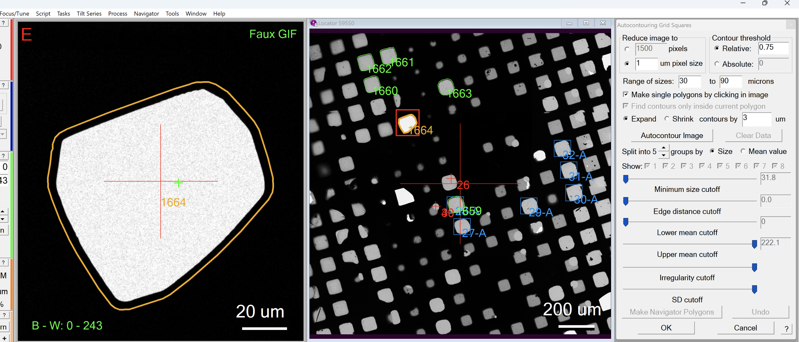

.. _utilize_locator_window:

SerialEM Note: Utilizing Locator Window
=======================================
  
:Author: Chen Xu
:Contact: <chen.xu@umassmed.edu>
:Date_Created: Aug. 2, 2026
:Last_Updated: Aug. 2, 2026

.. glossary::

   Abstract
      The Locator Window is a relatively new utility. It can be accessed
      from **Window → New Locator Window**. It is somewhat hidden, so most
      people don’t even realize it exists. However, it can be a very handy
      tool for certain tasks.

      In this note, I’d like to share how I use it.

.. _locate_good_mesh:

Locate a Good Mesh
------------------

Let’s say you have just collected an LMM of the grid and want to quickly
identify a dozen or so “good” meshes with good ice coverage. Normally, you
can zoom in and out using the mouse scroll wheel, use the left mouse button
to move around the image, and then add a polygon when you find a good mesh.
This works fine, but I find that the Locator Window can make this process
much easier.

This is how I do it.

**Fig.1 Locator Window**

..   :height: 544 px
..   :width: 384 px
   :alt: find and center a mesh
   :align: center

1. Open the Locator Window from **Window → New Locator Window**. I usually
put it side-by-side with the main display window. You can put it on the
right or left side, whichever you prefer.

2. Draw a rectangular area in the Locator Window using **Ctrl+Shift+left
moue button**. It is a red box. The area inside the rectangle will be
automatically zoomed in the main window, so it shows only that area. In my
case, I usually draw the rectangle to cover a single mesh.

3. Click on a mesh in the Locator Window, and the red box will move to where
you clicked. The mesh will then appear highly zoomed in in the main window,
so you can see the details much better.

4. If you like the mesh, you can add a polygon around it directly in the
zoomed-in main window with a single **Ctrl+Shift+left mouse click**. To do
this, make sure the **“Make single polygon by clicking in image”** option is
checked in the **Autocontouring Grid Squares** dialog.

5. You can repeat this for all the other good meshes you want to select.

