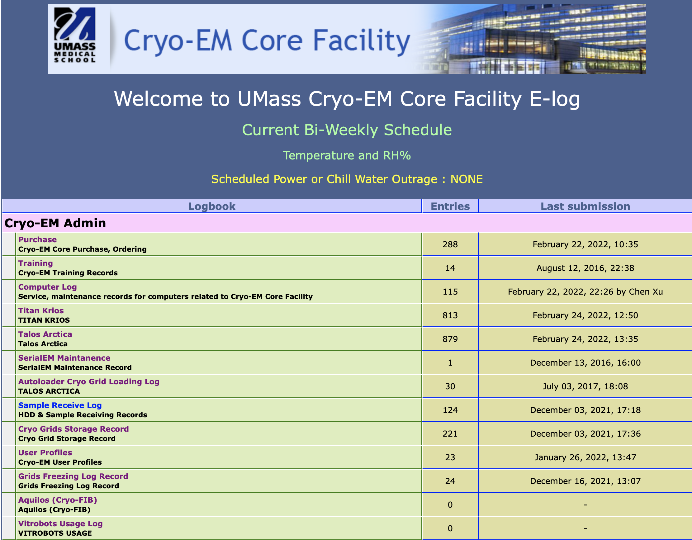
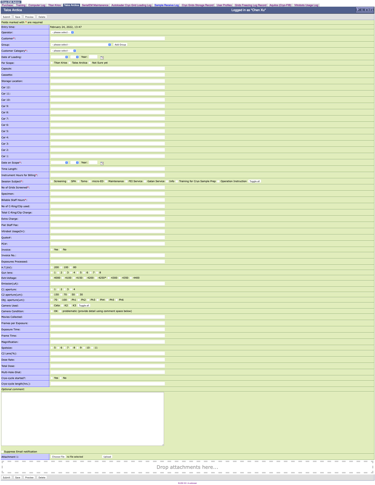

.. _elog:

Setup Simple Lab Electronic Logbook
===================================

:Author: Chen Xu
:Contact: <Chen.Xu@umassmed.edu>
:Date_Created: Feb 24, 2022
:Last_Updated: Feb 24, 2022

.. _glossary:

   Abstract
      It is desirable to have very simple electronic log books for a
      scientific research laboratory. For an electron microscope lab, it
      would be very nice to be able to record all the imaging conditions,
      grid information etc. and all that. And it would be even better if
      such program can be easily configurable.

      After much searching, we found a little program called **ELOG**. It
      was originally developed by high energy physics people for their
      experiment log. We found this fit our needs very well. I share some
      of the information here with you.

Elog
----

The program can be found in `https://elog.psi.ch/elog/
<https://elog.psi.ch/elog/>`_. It is open source and can be installed on
Linux, Windows, MacOS and FreeBSD. It doesn't reply on any existing web
server. Instead, it comes with its own web server **elogd** running as a
daemon style. It has a built-in very simple database. Here is a snapshot of
the program main interface for our intranet access. 

You can see it has multiple e-logbooks you can access. Each log book has its
own config file and you can directly edit it from web interface. After
saving the change, the **elogd** takes it in automatically. 

Config
------

Here is one example entry page to enter all the information for a Talos
session.

Below is the config file for this page shown above. 

.. code:: python

   Restrict edit = 1

   ; look and feel
   Guest menu commands = Back, Find, Login, Help
   Guest find menu commands = Find, Login, Help
   Date format = %a, %b %d, %Y
   ;Time format = %A, %B %d, %Y, %H:%M
   Time format = %B %d, %Y, %H:%M
   Display mode = summary

   Theme = default
   Comment = Talos Arctica

   ; Attributes
   Attributes = Operator, Customer, Group, Customer Category, Date of Loading, For Scope, Capsule, Cassette, Storage Location, Car 12, Car 11, Car 10, Car 9, Car 8, Car 7, Car 6, Car 5, Car 4, Car 3, Car 2, Car 1, Date on Scope, Time Length, Instrument Hours for Billing, Session Subject, No of  Grids Screened, Specimen, Billable Staff Hours, No of C-Ring/Clip used, Total C-Ring/Clip Charge, Extra Charge, Flat Staff Fee, Vitrobot Usage(hr), Quote#, PO#, Invoice, Invoice No., Exposures Processed,  H.T.(kV),  Gun lens, Extr.Voltage, Emission(uA), C1 aperture , C2 aperture(um) , Obj. aperture(um), Camera Used, Camera Condition, Movies Collected, Frames per Exposure, Exposure Time, Frame Time, Magnification, Spotsize, C2 Lens(%), Dose Rate, Total Dose, Multi-Hole-Shot, Cryo-cycle started?, Cryo-cycle length(hrs.)

   ;List display = ID, Date on Scope, Customer, Customer Category, Session
   Subject, Instrument Hours for Billing, No of  Grids Screened, No of
   C-Ring/Clip used, Extra Charge, Flat Staff Fee, Billable Staff Hours,
   Invoice,  Invoice No.

   Options Operator = KangKang, Chen, Kyounghwan, Albert, Christna, Jeng-Yih, ZhongWu, Customer

   ;Extendable Options = Customer Options 

   Group = group1, group2 
   
   Extendable Options = Group
   Options Customer Category = Internal Academic, External Academic, Industry Partner, Industry, not sure
   Options Time Length = 
   Options Instrument Hours for Billing = 
   MOptions Session Subject = Screening, SPA, Tomo, micro-ED, Maintenance, FEI Service, Gatan Service, Info, Training for Cryo Sample Prep, Operation Instruction
   Option Billable Staff Hours  = 
   Option No of Grids Screened = 
   ROptions For Scope = Titan Krios, Talos Arctica, Not Sure yet
   ROptions Invoice = Yes, No
   ROptions H.T.(kV) = 200, 100, 80
   ROptions Gun lens = 1, 2, 3, 4, 5, 6, 7, 8
   ROptions Extr.Voltage = 4000, 4100, 4150, 4200, 4250*, 4300, 4350, 4400
   ROptions Column vacuum crash = 0, 1, 2, 3, more  
   ROptions C1 aperture = 1, 2, 3, 4
   ROptions C2 aperture(um) = 150, 70, 50, 30
   ROptions Obj. aperture(um) = 70, 100, Ph1, Ph2, Ph3, Ph4, Ph5, Ph6
   MOptions Camera Used = Ceta, K2, K3
   ROptions Camera Condition = OK, problematic (provide detail using comment space below)
   ;ROptions Filter Used? = Yes, No
   ;Roptions Slit Width = 20, 25, 30, 35, 40
   ROptions Spotsize = 5, 6, 7, 8, 9, 10, 11
   ROptions Cryo-cycle started? = Yes, No
   Options Cryo-cycle length(hrs.) =
   ROptions Staff Flat Fee = Yes, No

   ; Required Attributes
   Required Attributes = Date on Scope, Customer, Group Head (PI), Customer Category, Instrument Hours for Billing,  Session Subject, No of  Grids Screened, Billable Staff Hours
   ; extendable options 
   ;Extendable Options = Hours
   ;Extendable Options = Session Subject
   ;Extendable Options = Extr.Voltage
   ; comment of Attribute
   ; Comment Session Subject = E.g. Practice, C-complex data collection etc.

   ; flags
   Message comment = <i>Optional comment:</i>
   List display = ID, Date on Scope, Customer, Group, Customer Category, Session Subject, Instrument Hours for Billing, No of  Grids Screened, No of C-Ring/Clip used, Extra Charge, Flat Staff Fee, Billable Staff Hours, Vitrobot Usage(hr), Quote#, PO#, Invoice,  Invoice No.
   Type Date on Scope = date
   Type Date of Loading = date
   Menu commands = List, New, Edit, Delete, Find, Last Day, Logout, Help
   ;Preset Name = $long_name
   HTML default = 2
   ; disable attachment
   Enable attachments = 1
   Show attachments = 0

   ; Combine attributes into singles lines
   ;; using Format, kind of messy
   ;Format Date on Scope = 1

   Page Title = UMass CryoEM Log - $Session Subject / $Name
   Reverse sort = 1
   Quick filter = Date, Customer, Session Subject

.. note:: you can see a single, long line is needed for after "=". 

Install on FreeBSD 
------------------

There are available install packages for Windows and Linux OS. This makes
things easier. For other system, you can build it from source code. We have
it running on a Linux workstation where we use for our processing. I also
have a backup elog running on **TrueNAS** system in a jail. 

After unpacking from the source code, one can simply compile it with
*gmake* in main directory.

.. code:: 

   gmake 

If it compiles successfully, you can then just copy the *elogd* to a
location like /usr/local/sbin. To make it running automatically after
computer starts, we need a rc script as below.

.. code:: 

   #!/bin/sh

   # PROVIDE: xuchen

   . /etc/rc.subr

   name="elogd"
   start_cmd="${name}_start"
   stop_cmd="${name}_stop"

   elogd_start() {
      echo "elogd starting"
      # your commands here
      /usr/local/bin/sudo -u elog /usr/local/sbin/elogd -D -c /usr/local/elog/elogd.cfg -d /usr/local/elog/logbooks
   }

   elogd_stop() {
      echo "qssite stopping"
      # your commands here
   }

   run_rc_command "$1"

And also we need an entry in /etc/rc.conf like this.

.. code:: 

   elogd_enable="YES"

After jail starting, the **elogd** runs at the background and you can point
your web browser to jail's IP with port 8080 which is default for elog running
at. 
